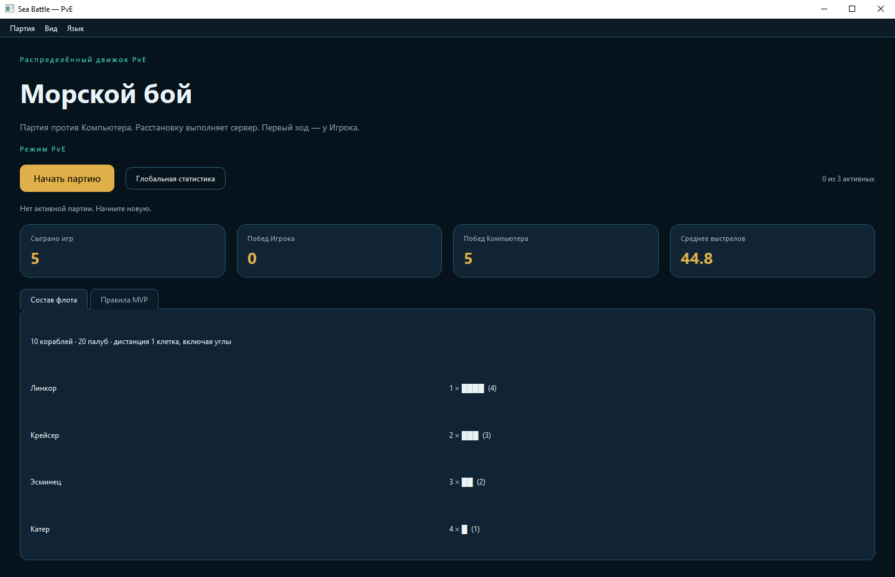
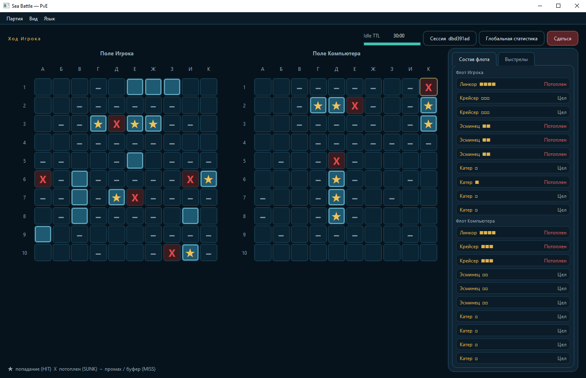

# Описание проекта:

Пет-проект **Sea Battle** разработан для демонстрации возможностей AI-assisted разработки в **Cursor** (практика vibe coding, работа с нереляционным хранилищем Redis, контракт OpenAPI).

**Стек:** Python 3.12+, окно PySide6 на хосте, FastAPI + Uvicorn, Redis 7, REST + WebSocket, Docker Compose (сервисы `redis` и `backend` на порту 8000), pytest. Матрица вероятностей на клиент не уходит.

В Cursor собрана мультиагентная система: роли (PM, аналитик, архитектор, технический писатель, дизайнер, разработчики UI и прикладного слоя, тестировщик, критик качества), скиллы и slash-команды. Описание: [documentation/mas-description.md](documentation/mas-description.md). Список команд: [.cursor/list-commands.md](.cursor/list-commands.md). MAS — способ разработки, не суть продукта. Вход для агентов: `/pm`.

В качестве учебной и продуктовой задачи выбран пошаговый морской бой с серверным ИИ. Это удобный полигон: DDD / Clean Architecture, контракт OpenAPI, лимит трёх независимых сессий, idle TTL 30 минут и reconnect без сброса TTL.

Витрина портфолио: [artifacts/portfolio/README.md](artifacts/portfolio/README.md). Лицензия: [MIT](LICENSE).



Лобби: старт партии, глобальная статистика, состав флота. Соперник на экране подписан «Компьютер».



Партия: своё поле с кораблями, поле Компьютера без чужих палуб до попадания; Idle TTL; статусы флота.

## Этапы выполнения проекта:

Работа над проектом выполнялась этапами: границы продукта, требования, диаграммы сценариев, доменная модель, затем маленькие рабочие срезы интерфейса и прикладного слоя, проверка качества и релиз.

1. **Границы продукта.** Зафиксировали, зачем нужен локальный PvE-контур, что входит в MVP и что сознательно снаружи. Предварительное ТЗ: [documentation/specification-sea-battle-v1-1.md](documentation/specification-sea-battle-v1-1.md). Vision & Scope (согласовано 2026-09-20): [artifacts/vision-scope.md](artifacts/vision-scope.md). Техническое задание по ГОСТ 34.602-89 (согласовано 2026-09-20): [artifacts/tz-gost-seabattle.md](artifacts/tz-gost-seabattle.md). Уточнения `Axxxx` и согласованные ФТ/НФТ важнее предварительного ТЗ.
2. **Требования.** Собрали общий язык и проверяемое поведение: [глоссарий](requirements/glossary.md), [функциональные требования](requirements/functional-requirements.md) (FT-001…FT-080), [нефункциональные требования](requirements/non-functional-requirements.md) (20 НФТ, NFT-001…NFT-020), восемь [user stories](requirements/user-stories/us-registry.md) (US-001…US-008) и восемь [use cases](requirements/use-cases/list-uc.md) (UC-001…UC-008). Закрытые решения по ходу уточнений: [requirements/answers-project.md](requirements/answers-project.md).
3. **Диаграммы сценариев.** По use cases нарисовали две sequence-диаграммы Mermaid: [выстрел и ход Бэкенда](diagrams/diagram-seq-001.md) (UC-002, UC-003) и [reconnect](diagrams/diagram-seq-002.md) (UC-006). C4, состояния сессии, BPMN и прочие схемы — в `diagrams/` и во [входном файле витрины](artifacts/portfolio/README.md).
4. **Доменная модель.** Описали игровую сессию как ограниченный контекст: агрегат Session, инварианты флота и хода, heatmap только на сервере, ключи Redis (сессии с TTL и журнал статистики). [Модель DDD](requirements/domain-model.md), [словарь данных](requirements/data-dictionary.md). Стек: [reports/project-config.md](reports/project-config.md). Контракт API: [requirements/openapi.yaml](requirements/openapi.yaml).
5. **Реализация срезами.** Сначала макет окна (вид и навигация без игровой логики), затем рабочие куски S-00…S-08: каркас Compose, старт сессии, выстрел по WebSocket, ход Бэкенда, GAME_OVER, сдача, reconnect, статистика, язык UI. Чеклист: [reports/checklist.md](reports/checklist.md). UI — `src/frontend/` (PySide6, launcher `src/run-frontend.bat`); прикладной слой — `src/backend/` (`domain/`, `application/`, `infrastructure/`, `presentation/`).
6. **Проверка качества.** Согласованность пакетов: [ФТ/НФТ](reports/incompatibility-ft-nft.md), [доменная модель](reports/domain-model-review.md). Автотесты pytest по домену, API и клиенту без живого окна (279 passed): [`tests/`](tests/coverage.md), отчёт [reports/test-run.md](reports/test-run.md).
7. **Релиз MVP 1.0.0.** Снимок на git-теге `v1.0.0` (ветка `main`). Установщика `.exe` нет: ревьюер собирает API из Compose и открывает десктопное окно Python. Запуск на другом компьютере без Cursor: [reports/instruction.md](reports/instruction.md). Подъём и проверка API у разработчика: [reports/instruction-api.md](reports/instruction-api.md).

Структура папок и правила именования: [documentation/project-structure-v1-1.md](documentation/project-structure-v1-1.md).

## Запуск

API (из корня репозитория, на своей машине — не из терминала агента Cursor):

```powershell
docker compose up --build
```

Файлы Redis на хосте по умолчанию — `F:/Docker/Redis`. Другой диск или папка: `REDIS_DATA_DIR` в `.env` (образец `.env.example`).

Окно игры: дважды щёлкните `src/run-frontend.bat` или:

```powershell
cd src
$env:PYTHONPATH = (Get-Location).Path
python -m frontend
```

Контракт OpenAPI: `requirements/openapi.yaml`. Просмотр Swagger/ReDoc: `requirements/run-openapi-docs.bat` (порты 8080/8081). Try it out работает, только если поднят Compose-бэкенд на 8000.

Полный сценарий «клон на другом ПК, без Cursor»: [reports/instruction.md](reports/instruction.md). Подъём API у разработчика: [reports/instruction-api.md](reports/instruction-api.md).
