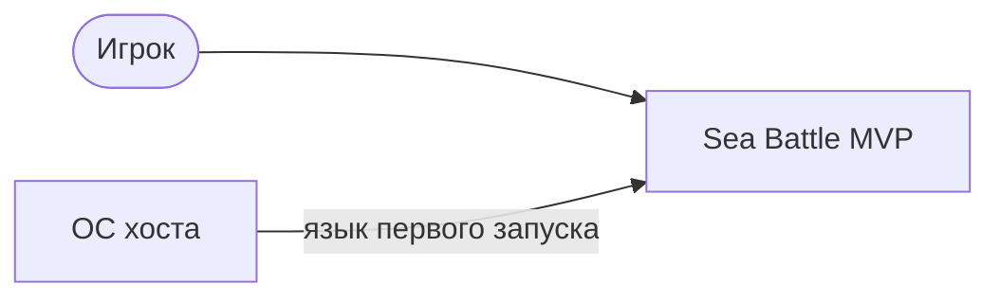

# Vision & Scope — Sea Battle

| Поле | Значение |
| --- | --- |
| Продукт | Sea Battle (PvE) |
| Версия документа | 1.0 |
| Дата | 2026-09-17 |
| Статус | Черновик, требует согласования |
| Аудитория | заказчик (он же разработчик), аналитик, архитектор |
| Режим | после пакета требований |
| Пакеты (контекст, не статус Vision) | ФТ/НФТ согласованы 2026-08-24; US A0114; UC A0146; глоссарий A0162 |

Согласование этого документа — фраза «согласую Vision» / «принимаю Vision & Scope». Не путать с «утверждаю» этапа MAS.

---

## 1. Назначение документа

Документ фиксирует **зачем** существует продукт, **для кого**, **что входит в MVP** и **что сознательно исключено**. Он не заменяет таблицы функциональных и нефункциональных требований и не служит протоколом приёмки функций: при конфликте приоритет у закрытых ответов `Axxxx` и согласованных пакетов в `requirements/`.

## 2. Связанные документы

| Документ | Путь |
| --- | --- |
| Предварительное ТЗ | `documentation/specification-sea-battle-v1-1.md` |
| Закрытые ответы | `requirements/answers-project.md` |
| ФТ / НФТ | `requirements/functional-requirements.md`, `requirements/non-functional-requirements.md` |
| Глоссарий | `requirements/glossary.md` |
| US / UC | `requirements/user-stories/`, `requirements/use-cases/` |
| Домен, словарь, API | `requirements/domain-model.md`, `requirements/data-dictionary.md`, `requirements/openapi.yaml` |
| Конфиг и чеклист | `reports/project-config.md`, `reports/checklist.md` |
| Витрина портфолио | `artifacts/portfolio/` |
| ТЗ по ГОСТ 34.602-89 | `artifacts/tz-gost-seabattle.md` |

## 3. Краткое резюме

Sea Battle — клиент-серверная пошаговая игра «Морской бой» в режиме **игрок против Бэкенда (PvE)** для одного человека за десктопным окном. Ценность — провести партию по каноническим правилам, со скрытием чужого флота и серверным ходом по матрице вероятностей, без логина и без PvP. MVP ограничен тремя активными сессиями, idle TTL 30 минут, каналом партии в реальном времени для выстрела и сдачи, глобальной (не персональной) статистикой и языками RU/EN только на Фронтенде.

## 4. Предыстория

Инициатива описана в предварительном ТЗ как пет-проект и инженерный полигон (DDD, REST + WebSocket, контейнеры, портфолио полного цикла). После ТЗ пакет `Axxxx` уточнил лимиты и каналы: слот сессии только после успешного старта (A0081); выстрел игрока только по каналу партии (A0089); reconnect без сдвига idle TTL и без экрана ввода id (A0093, A0144); сдача = явный выход (A0092); heatmap игроку не показывать (A0014). Код MVP закрыт срезами S-00…S-08 (2026-09-17).

## 5. Проблема и бизнес-возможность

**Проблема стейкхолдера:** нет компактного, проверяемого образца «от согласованных требований до работающего клиента и сервера» для демонстрации компетенций аналитика и архитектора; учебные «морские бои в одном процессе» не показывают сессии, контракт API и скрытие состояния.

**Возможность:** поставить локальную АС с полным контуром требований и приёмки (автотесты + ручное окно), пригодную для портфолио и самообучения, без выхода на рынок и без операционного SLA.

Коммерческая модель, тарифы и доля рынка в источниках **не зафиксированы**.

## 6. Цели проекта

### 6.1. Бизнес-цели (Business Goals)

Источник верхнего уровня — предварительное ТЗ §1 (пет-проект, полигон, портфолио). Измеримые рыночные KPI в источниках нет; ниже — формулировки ценности стейкхолдера, согласованные с фактом закрытого MVP.

| ID | Цель | Ценность | Горизонт / проверка | Источник |
| --- | --- | --- | --- | --- |
| BG-1 | Иметь демонстрируемый полный цикл «требования → работающий PvE» | Снижение риска «пустого» портфолио: есть артефакты и живое окно | MVP поставлен, когда закрыты US-001…US-008 и срезы кода S-00…S-08 | ТЗ §1 |
| BG-2 | Отработать практики контрактного клиента-сервера без нагрузки продакшена | Экономия времени на учебном контуре: лимит 3 сессии вместо масштабирования | Контрольная нагрузка MR-01 | ТЗ §1; NFT MR-01 |
| BG-3 | Не раскрывать скрытую информацию партии постороннему клиенту | Снижение риска «подглядывания» флота и heatmap в учебном канале | NFT-009, NFT-010 | A0048; FT-015; FT-050 |

### 6.2. Цели продукта (Product Goals)

| ID | Цель продукта | Связь с BG |
| --- | --- | --- |
| PG-1 | Проводить партию PvE по правилам 10×10 / 10 кораблей с авторасстановкой | BG-1 |
| PG-2 | Исполнять ход Бэкенда алгоритмом Hunt/Target без выдачи heatmap | BG-1, BG-3 |
| PG-3 | Держать до трёх независимых сессий с idle TTL и слотом лимита | BG-2 |
| PG-4 | Синхронизировать партию по каналу реального времени; REST — старт и статистика | BG-1 |
| PG-5 | Вести глобальную статистику только по `GAME_OVER` | BG-1 |
| PG-6 | Дать RU/EN интерфейс без хранения языка на Бэкенде | BG-1 |

## 7. Критерии успеха MVP

Проверяемо, без «удобно»:

1. Игрок начинает партию, получает свой флот, не видит флот Бэкенда до `HIT`/`SUNK` (FT-001, FT-014, FT-015; UC-001).
2. Выстрел игрока и ход Бэкенда меняют поля по правилам `MISS`/`HIT`/`SUNK` (US-002, US-003).
3. Четвёртая активная сессия отклоняется (FT-049).
4. `GAME_OVER` (флот или сдача) пишет статистику один раз на `sessionId` и освобождает слот (FT-056, A0128, A0129).
5. Возобновление канала того же запуска восстанавливает FT-002 без сдвига TTL (FT-054, NFT-007); после рестарта приложения Фронтенд сессию не подхватывает (A0093).
6. Автотесты Must-правил партии существуют (NFT-011); прогон репозитория на дату закрытия S-08 — 279 passed (`reports/test-run.md`).
7. Фронтенд проводит партию на Windows 10 x64 при доступном Бэкенде (NFT-014).

Интернет-SLA и 24/7 в критерии **не входят** (вне MVP НФТ).

## 8. Потребности пользователей

### 8.1. Профиль

| Атрибут | Факт |
| --- | --- |
| Роль | **Игрок** (R-01). Системные участники Бэкенд (R-02) и Фронтенд (R-03) — не люди-заказчики. Учётной записи нет (A0016). |
| Контекст | Личный пет-проект; **заказчик = разработчик**. Корпоративный заказчик и рынок в источниках не заданы. |
| Ожидания от UI | Основной сценарий — **окно** (кнопки, поля, меню), не CLI как основной путь партии. |
| Инфраструктура вне UI | Игрок (как оператор стенда) **сам** устанавливает Python 3.12+, зависимости Фронтенда, Docker Compose для Redis и API. Учётные записи внешних SaaS не требуются. |
| Сообщения об ошибках | Короткие тексты в UI (RU/EN); единый отказ «сессия недоступна» без различия причин для игрока (A0001). Разбор по логам сервера — не основной UX. |
| Вне компетенции | Администрирование кластера, PvP, ручная расстановка, работа без Бэкенда для живой партии. |

На экране сторона соперника подписывается «Компьютер» (A0153); в этом документе канон — **Бэкенд**.

### 8.2. Потребности

| Потребность | Как закрывает продукт |
| --- | --- |
| Начать партию против ИИ | US-001, UC-001, FT-001…FT-016 |
| Стрелять и видеть результат | US-002, FT-017…FT-024, FT-055 |
| Видеть ответный ход без ручного ввода | US-003, FT-027…FT-034, FT-036 |
| Понять конец партии и счёт | US-004, US-007, FT-025, FT-038…FT-042 |
| Выйти, не доигрывая | US-005, FT-077 |
| Продолжить после обрыва связи в том же запуске | US-006, FT-054 |
| Играть на RU или EN | US-008, FT-059…FT-062 |

## 9. Видение решения

**Для** человека, который хочет сыграть в «Морской бой» против серверного ИИ и показать инженерию проекта,  
**продукт** Sea Battle  
**который** проводит PvE-партию в десктопном окне с серверным состоянием и каналом реального времени,  
**в отличие от** однопроцессных игрушек без сессий, контракта API и скрытия флота,  
**наш продукт** сочетает согласованные требования, OpenAPI и контейнерный Бэкенд с лимитом учебного контура.

## 10. Ключевые возможности

Группы, не копия таблиц ФТ.

| Группа | Содержание | Ссылки |
| --- | --- | --- |
| Старт PvE | Создание сессии, два флота, выдача только флота игрока, первый ход игрока | FT-001, FT-010, FT-014, FT-016; US-001 |
| Правила поля | 10×10, состав 1+2+3+4, дистанция, коды клеток | FT-006…FT-013, FT-063 |
| Выстрел и ход | Канал партии; отказ REST-выстрела; HIT сохраняет ход | FT-017…FT-024, FT-055; US-002 |
| ИИ Бэкенда | Heatmap Hunt/Target, ничья весов, добивание одного корабля | FT-027…FT-034, FT-058, FT-064, FT-079; US-003 |
| Скрытие | Флот Бэкенда и heatmap не в клиенте | FT-015, FT-050; NFT-009 |
| Лимит и жизнь сессии | 3 слота; idle 30 мин; обрыв ≠ сдача | FT-004, FT-005, FT-049, FT-053, FT-074 |
| Конец | `GAME_OVER`, статистика, сдача | FT-025, FT-056, FT-077; US-004, US-005 |
| Канал и reconnect | Один живой WS; снимок; TTL не от handshake | FT-054, FT-067, FT-068; US-006 |
| Язык | RU/EN, ОС при первом запуске, локально | FT-059…FT-062, FT-073; US-008 |
| Наблюдаемость TTL | Остаток idle на Фронтенде | FT-080 |

## 11. Область проекта

### 11.1. MVP (in scope)

Десктопный Фронтенд; API старта и статистики; канал партии; Redis-состояние; Heatmap Bot; глобальная статистика; RU/EN; до 3 сессий; автотесты правил; Compose Redis+API.

### 11.2. Post-MVP (явно не сейчас)

PvP; логин и персональная статистика; ручная расстановка; экран ввода id и resume после рестарта приложения (контракт Бэкенда FT-054 при этом сохраняется); Linux/macOS клиент (A0046); 24/7 и интернет-SLA; горизонтальное масштабирование сверх 3 сессий; лимит времени на ход игрока (A0050).

### 11.3. Out of scope

Вред жизни/здоровью (Safety как НФТ не применяется). Маркетплейс, монетизация, античит корпоративного класса, SQL как канон хранения.

## 12. Ограничения

| Ограничение | Норма | Источник |
| --- | --- | --- |
| Активные сессии | не более 3 | FT-004, A0012 |
| Idle TTL | 30 мин; сдвигают создание и принятый выстрел | FT-005, A0144 |
| Канал выстрела и сдачи | только канал партии реального времени | FT-055, FT-077 |
| Платформа UI | Windows 10 x64 для приёмки NFT-014 | A0046 |
| Сеть измерения | localhost/LAN, без интернет-SLA | MR-02, A0047 |
| Идентификатор сессии | пространство ≥ 2^128 | NFT-017, A0149 |
| Язык на сервере | не хранится | A0091 |
| Стек | Python 3.12+, FastAPI, Redis, PySide6, Docker | ТЗ §2, `project-config` |

### 12.1. Критерии исключения

| Ограничение | Условие нарушения | Поведение системы | Источник |
| --- | --- | --- | --- |
| 3 сессии | запрос 4-й при трёх активных | отказ создания, слот не занимается | FT-049, A0081 |
| Окно старта | нет валидной расстановки за NFT-015 | единый отказ старта, без сессии и статистики | FT-010 |
| Idle TTL | истекли 30 мин без сдвигающих событий | удаление без `GAME_OVER` и без статистики; оповещение FT-066 | FT-053, FT-066 |
| Выстрел не по каналу партии | REST или иной канал | отказ `SHOT_WRONG_CHANNEL`, состояние не меняется | FT-055, A0089 |
| Сдача не по каналу | REST surrender | отказ, партия жива | FT-077 |
| Второй живой клиент | handshake при живом WS | отказ FT-068 | A0002 |
| Неизвестный id | resume/handshake | единый отказ, без раскрытия существования | FT-067, A0001 |
| Пустая heatmap, флот жив | нет клетки с весом > 0 после FT-052 | `SESSION_ABORTED`, затем удаление, без статистики | FT-075, FT-076 |
| Скрытые данные | запрос клиента | heatmap и целые палубы Бэкенда не передаются | FT-015, FT-050, NFT-009 |

Модель «молча обрезать четвёртую сессию» **вне канона**: канон — явный отказ FT-049.

## 13. Допущения

| ID | Допущение |
| --- | --- |
| AS-01 | Оператор стенда может установить Docker и Python и запустить Compose плюс окно Фронтенда. |
| AS-02 | Один хост или LAN достаточны; публичный интернет не требуется. |
| AS-03 | Игрок понимает классические правила «Морской бой» (Russian standard). |
| AS-04 | Redis и API из поставки MVP — единственное хранилище состояния партии. |

## 14. Зависимости

- Согласованный пакет требований и OpenAPI.
- Runtime: Python 3.12+, PySide6, Docker Engine, образ Redis 7.
- ОС хоста для языка первого запуска (FT-060).
- Не зависит от внешних игровых платформ и IdP.

## 15. Риски

| Риск | Влияние | Митигация в MVP |
| --- | --- | --- |
| Сбой пустой heatmap | Партия прерывается | Явное `SESSION_ABORTED`, слот свободен, без порчи статистики (FT-075/076) |
| Демо на 4 окнах | Отказ старта | Лимит 3 — учебный; показывать осознанно |
| Путаница reconnect | Ожидание партии после рестарта `.bat` | A0093: только тот же процесс |
| Подбор id | Доступ к чужой партии | NFT-017, NFT-010, единый отказ |

## 16. Стейкхолдеры

| Роль | Интерес |
| --- | --- |
| Заказчик-разработчик | Портфолио, полигон, закрытие MVP |
| Игрок | Партия в окне (профиль §8) |
| Будущий рекрутер / ревьюер | Читаемые границы и диаграммы (`artifacts/portfolio/`) — не актор системы |

Администратор АС, второй человек (PvP) — **не стейкхолдеры MVP**.

## 17. Приоритеты проекта

MoSCoW ФТ: партия без Must невозможна; Should — TTL, статистика, reconnect, оповещения. При конфликте ресурсов: **целостность правил боя и скрытие состояния** важнее статистики и смены языка; язык Must по FT-059, но не блокирует механику выстрела. НФТ все Must, пока заказчик не задал иное.

## 18. Среда эксплуатации

Локальный стенд: процесс Фронтенда на хосте; контейнеры API (`:8000`) и Redis. Измерения — MR-02. Внешняя сущность кроме игрока — ОС (язык).

## 19. Связь с артефактами требований

| Тема Vision | ФТ / НФТ | US | UC |
| --- | --- | --- | --- |
| Старт | FT-001…FT-016, NFT-015 | US-001 | UC-001 |
| Выстрел игрока | FT-017…FT-024, FT-055, NFT-001 | US-002 | UC-002 |
| Ход Бэкенда | FT-027…FT-034, NFT-002 | US-003 | UC-003 |
| Конец и статистика | FT-025, FT-038…FT-042, FT-056 | US-004, US-007 | UC-004, UC-007 |
| Сдача | FT-077 | US-005 | UC-005 |
| Reconnect / TTL | FT-005, FT-053, FT-054, NFT-007 | US-006 | UC-006 |
| Язык | FT-059…FT-073, NFT-016 | US-008 | UC-008 |
| Защита состояния | FT-015, FT-050, NFT-009…NFT-010 | — | — |

## 20. История изменений

| Версия | Дата | Изменение |
| --- | --- | --- |
| 1.0 | 2026-09-17 | Первая редакция по пакету требований и закрытому MVP |

## 21. Вопросы по Vision

Открытых вопросов, блокирующих границы MVP, **нет**: пакеты ФТ/НФТ/US/UC согласованы, ответы `Axxxx` закрывают лимиты §12.1.

Рекомендация при появлении новой темы: не расширять MVP без явной смены scope в ФТ.
