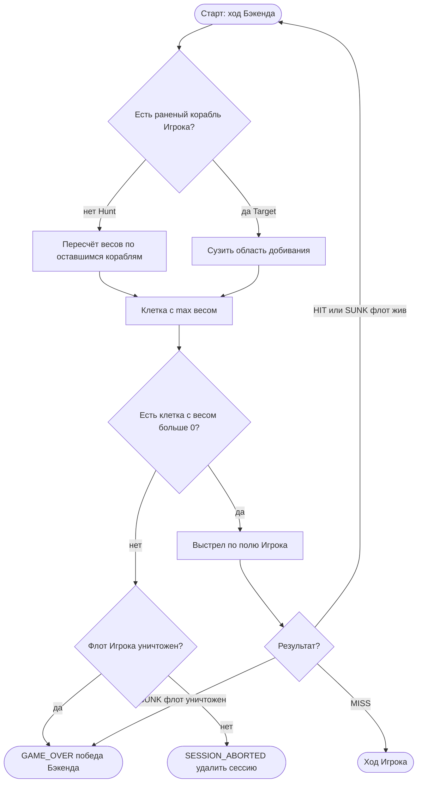

# Hunt / Target — обзор для слайда

**Тип:** flowchart  
**Срез:** упрощение UC-003 / US-003 без ID ФТ на схеме.  
**Статус:** черновик витрины. Канон ветвлений не заменяется: [diagram-mermaid-001.md](diagram-mermaid-001.md).

## Источники

Тот же ход Бэкенда, что канон: heatmap, Hunt если нет раненого, Target если есть; пустые веса — abort или победа; MISS отдаёт ход Игроку.

**Намеренно вне слайда:** крест vs ось Target, ничья весов, лимит 20 выстрелов в коде.

---

**Проверено (§1.3):** шаги канона сжаты; heatmap в UI нет (ограничение в ADR-005, не узел).
