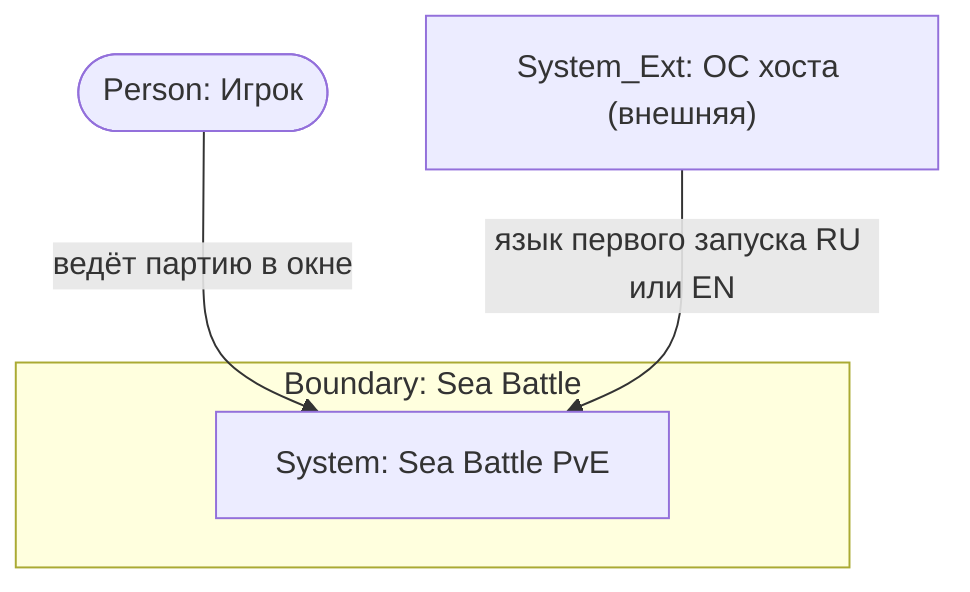
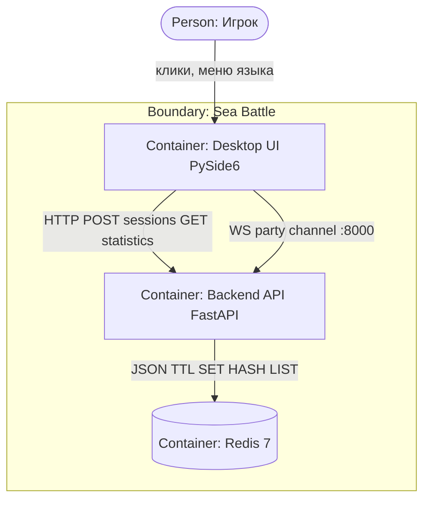
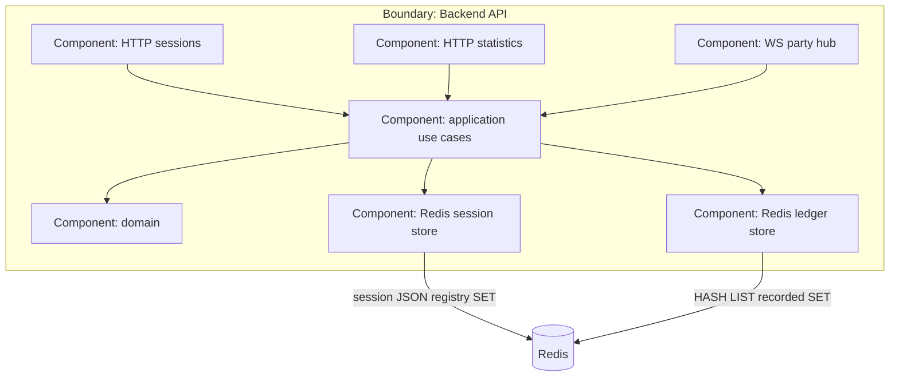
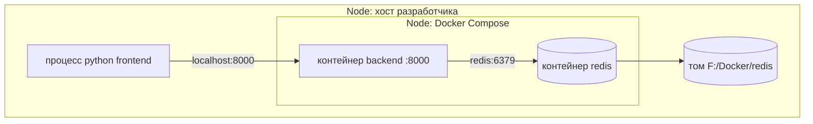

# C4: Sea Battle MVP (as-is)

**Тип:** C4 Context / Container / Component / Deployment как `flowchart` (эквивалент; нативный `C4*` не использован из‑за совместимости превью).  
**Срез:** продукт Sea Battle PvE, факт репозитория 2026-09-17.  
**Статус:** черновик витрины для согласования.

## Источники

- [README.md](../README.md), [docker-compose.yml](../docker-compose.yml)
- [src/backend/main.py](../src/backend/main.py), пакеты `presentation` / `application` / `domain` / `infrastructure`
- [src/frontend/](../src/frontend/) (`ui/`, `client/`)
- [requirements/openapi.yaml](../requirements/openapi.yaml)
- [architecture.md](../artifacts/portfolio/architecture.md)

**Приоритет фактов:** код и OpenAPI важнее предварительного ТЗ при расхождении.

## 1. Граница системы

**Внутри продукта:** десктопный Фронтенд, HTTP+WS API, Redis, доменные правила боя.

**Снаружи:** Игрок (человек); хост ОС (язык первого запуска UI — UC-008). Нет внешних SaaS, очередей, IdP.

**Намеренно вне схем:** просмотрщики Swagger/ReDoc на 8080/8081; MAS Cursor; pytest.

## 2. L1 Context

| Элемент | Роль C4 | Откуда |
| --- | --- | --- |
| Игрок | Person | list-us R-01 |
| Sea Battle | System | продукт репозитория |
| ОС | System_Ext | UC-008 шаг 0.1, не канал боя |

## 3. L2 Container

| Контейнер | Исполнение |
| --- | --- |
| Desktop UI | процесс хоста, PySide6 |
| Backend API | контейнер `backend`, порт 8000 |
| Redis | контейнер `redis:7-alpine` |

Связи: UI → API HTTP `POST /sessions`, `GET /statistics`; UI → API WS `/sessions/{id}/ws`; API → Redis ключи сессий и журнала.

## 4. L3 Component (только контейнер Backend API)

Маршруты `sessions`, `statistics`, `ws`; `PartyHub`; use case-ы; domain; Redis adapters. Heatmap — domain, не отдельный процесс.

## 5. Deployment

Хост разработчика: процесс UI; Docker Desktop: `backend` + `redis`; том Redis `F:/Docker/redis/` → `/data` (как в Compose).

---

## L1 Context

Эквивалент C4 Level 1; нативный `C4*` не использован из‑за совместимости превью.

Комментарий L1: один человек-актор. Фронтенд и Бэкенд на этом уровне не внешние системы.

---

## L2 Container

Эквивалент C4 Level 2; нативный `C4*` не использован из‑за совместимости превью.

Комментарий L2: UI не в Compose. Порт 8000 проброшен с `backend`.

---

## L3 Component — Backend API

Эквивалент C4 Level 3; нативный `C4*` не использован из‑за совместимости превью.

Комментарий L3: `PlayBackendTurns` вызывает heatmap в domain; отдельного контейнера ИИ нет. `PartyHub` — in-memory карта живых сокетов, не Redis.

---

## Deployment

Эквивалент C4 Deployment; as-is локального Compose.

Комментарий Deployment: путь тома — договорённость машины разработки; в другом окружении bind может отличаться, сервисы те же.

**Проверено (§5.5, §6):** L1–L3 и Deployment отдельными блоками; нет выдуманных IdP/очередей; внешняя только ОС; связи из OpenAPI и Compose; flowchart-эквивалент; as-is.
