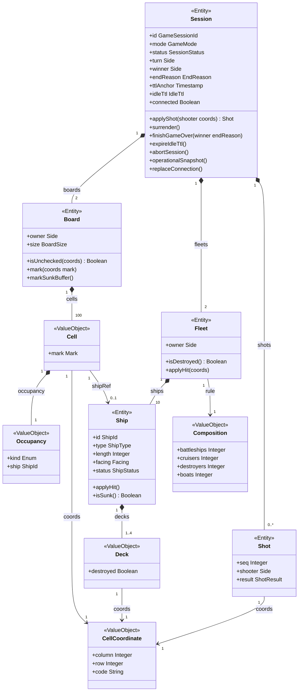
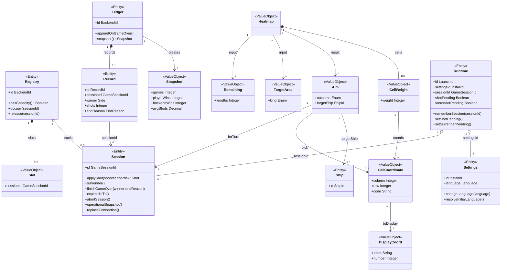

# Class diagram: доменная модель Sea Battle (MVP PvE)

**Тип:** classDiagram (Mermaid)  
**Срез:** сущности, объекты-значения и бизнес-действия агрегатов Session / Registry / Ledger / Settings / Runtime. Службы `StartSession` и `HeatmapBot` — в тексте, на схеме не рисуются.  
**Статус:** `Согласовано`, 2026-08-25 (A0148)  
**Дата:** 2026-08-25

---

## Источники

- [Доменная модель](../requirements/domain-model.md) — классы, атрибуты, кратности, инварианты
- [Реестр User Stories](../requirements/user-stories/list-us.md) — US-001…US-008
- [Реестр Use Cases](../requirements/use-cases/list-uc.md) — UC-001…UC-008
- Роли: [list-us.md](../requirements/user-stories/list-us.md) (Игрок / Бэкенд / Фронтенд; сущности «Игрок как учётная запись» нет — A0016)

**Приоритет фактов:** закрытые ответы `Axxxx` и согласованные ФТ важнее предварительного ТЗ. Имена классов и атрибутов — английские идентификаторы доменной модели.

Две схемы ниже — **один срез модели**, разделённый для превью: (1) внутренность агрегата `Session`; (2) межагрегатные связи, Heatmap-VO, статистика, Frontend. Наследования в источниках нет — на схемах его нет.

---

## 1. Noun extraction (US / UC)

Существительные из историй и сценариев, затем отбор по доменной модели.

| Кандидат из US/UC | Решение | Класс / куда делся |
| --- | --- | --- |
| партия, игровая сессия, матч | класс | `Session` (A0010: один объект) |
| поле | класс | `Board` |
| флот, расстановка | класс | `Fleet` |
| корабль; линкор / крейсер / эсминец / катер | класс + тип | `Ship`, `ShipType` |
| палуба | VO | `Deck` |
| клетка | VO | `Cell` |
| координаты, код клетки | VO | `CellCoordinate`; экранные буквы — `DisplayCoord` |
| выстрел, история выстрелов | класс | `Shot` |
| ход, право хода | атрибут | `Session.turn` (`Side`) |
| результат MISS / HIT / SUNK | enum / атрибут | `ShotResult`, `Cell.mark` |
| буферная зона | правило отметки | `Mark.MISS` на периметре, не отдельный класс |
| heatmap, матрица вероятностей, вес | VO | `Heatmap`, `CellWeight` |
| Hunt Mode / Target Mode | enum + VO области | `HeatmapMode`, `TargetArea` |
| оставшиеся корабли | VO | `Remaining` |
| цель выстрела Бэкенда | VO | `Aim` |
| слот, лимит активных сессий | корень + VO | `Registry`, `Slot` |
| статистика, сыгранные игры, победы, среднее | корень + VO | `Ledger`, `Snapshot` |
| запись завершённой партии | класс | `Record` |
| язык интерфейса | атрибут + enum | `Settings.language` (`Language`) |
| запуск Фронтенда, соединение, блокировка клика | корень | `Runtime` |
| idle TTL, оставшееся время | VO / атрибут | `IdleTtl` у `Session`; `RemainTtl` — копия для UI |
| идентификатор сессии | VO (ID) | `GameSessionId` |
| победитель, причина конца | атрибуты | `winner`, `endReason` |
| Игрок | **не класс** | роль US; учётной записи нет (A0016); сторона — `Side.Player` |
| Бэкенд, Фронтенд | **не классы** | акторы UC; состояние — агрегаты и службы |
| меню, экран, кнопка, анимация, канал, JSON | **не классы** | UI / транспорт, не предметная область |

Синонимы схлопнуты: «матч» = «игровая сессия»; «серверный ИИ / бот» в модели не используются как имена классов (канон — Бэкенд, служба `HeatmapBot`).

---

## 2. Классы на диаграмме

**Сущности (Entity):** `Session`, `Board`, `Fleet`, `Ship`, `Shot`, `Registry`, `Ledger`, `Record`, `Settings`, `Runtime`.

**Службы (не классы на схеме):** `StartSession` координирует слот `Registry` и создание `Session` (UC-001); `HeatmapBot.aim` считает `Aim` / `Heatmap` (UC-003). Атрибутов нет — это операции без состояния. Методы **не** перенесены в `Session` / `Registry`: матрица не входит в агрегат сессии; старт трогает два корня. Отдельного имени у «генерации расстановки» в модели нет.

**Объекты-значения на схеме:** `Cell`, `Occupancy`, `CellCoordinate`, `Deck`, `Composition`, `Slot`, `Heatmap`, `CellWeight`, `Remaining`, `TargetArea`, `Aim`, `Snapshot`, `DisplayCoord`.

**VO и перечисления только как типы атрибутов** (отдельные боксы не рисовались, чтобы не плодить связи «каждый enum — ко всем»): `GameSessionId`, `ShipId`, `BackendId`, `RecordId`, `InstallId`, `LaunchId`, `BoardSize`, `IdleTtl`, `SlotLimit`, `RemainTtl`, `ErrorCode`, `Glyph`, `Side`, `GameMode`, `SessionStatus`, `EndReason`, `ShipType`, `ShipStatus`, `Facing`, `Mark`, `ShotResult`, `Language`, `HeatmapMode`, `Occupancy.kind`, `Aim.outcome`.

---

## 3. Связи и мощности

Правило из запроса: «создаёт» → ассоциация; «содержит и не живёт без целого» → композиция; «содержит, но часть самостоятельна» → агрегация; «является» → наследование.

Между **корнями агрегатов** в модели только идентификаторы, без объектных ссылок. На схеме это всё равно показано как ассоциация/агрегация по смыслу владения ссылкой.

| От | К | Тип | Мощность | Смысл | Источник |
| --- | --- | --- | --- | --- | --- |
| `Ledger` | `Snapshot` | ассоциация | 1 → 1 | создаёт снимок при чтении | UC-007 |
| `Heatmap` | `Remaining` | ассоциация | 1 → 1 | вход Hunt: длины живых кораблей Игрока | FT-033, A0040 |
| `Heatmap` | `TargetArea` | ассоциация | 1 → 1 | вход Target: область добивания | FT-058 |
| `Heatmap` | `Aim` | ассоциация | 1 → 1 | результат расчёта клетки (служба `HeatmapBot`, не на схеме) | UC-003, FT-064 |
| `Session` | `Board` | композиция | 1 → 2 | `playerBoard`, `backendBoard`; поля без сессии нет | агрегат Session |
| `Session` | `Fleet` | композиция | 1 → 2 | `playerFleet`, `backendFleet` | агрегат Session |
| `Session` | `Shot` | композиция | 1 → 0..* | история выстрелов | FT-002 |
| `Board` | `Cell` | композиция | 1 → 100 | матрица поля | FT-006 |
| `Cell` | `Occupancy` | композиция | 1 → 1 | занятость клетки | VO Cell |
| `Fleet` | `Ship` | композиция | 1 → 10 | состав флота | FT-009 |
| `Ship` | `Deck` | композиция | 1 → 1..4 | палубы корабля | length по типу |
| `Registry` | `Slot` | композиция | 1 → 0..3 | занятые места лимита | FT-004 |
| `Ledger` | `Record` | композиция | 1 → 0..* | журнал завершённых игр | A0088 |
| `Heatmap` | `CellWeight` | композиция | 1 → 100 | веса клеток матрицы | heatmap 10×10 |
| `Registry` | `Session` | агрегация | 1 → 0..3 | слоты ссылаются на самостоятельные сессии по `GameSessionId` | A0143 |
| `Runtime` | `Session` | агрегация | 1 → 0..1 | id в памяти запуска; сессия живёт на Бэкенде | A0132, UC-006 |
| `Runtime` | `Settings` | агрегация | 1 → 1 | `settingsId`; настройки независимы от запуска | агрегат Frontend |
| `Cell` | `Ship` | ассоциация | 1 → 0..1 | `occupancy.ship` (ShipId), если палуба | внутри агрегата |
| `Shot` | `CellCoordinate` | ассоциация | 1 → 1 | цель выстрела | FT-017 |
| `Deck` | `CellCoordinate` | ассоциация | 1 → 1 | клетка палубы | FT-011 |
| `Cell` | `CellCoordinate` | ассоциация | 1 → 1 | адрес клетки | FT-063 |
| `CellWeight` | `CellCoordinate` | ассоциация | 1 → 1 | адрес веса | Heatmap |
| `Aim` | `Session` | ассоциация | 1 → 1 | расчёт на один ход одной сессии | служба, id не хранит |
| `Aim` | `CellCoordinate` | ассоциация | 1 → 0..1 | `pick` при `Picked` | FT-064 |
| `Aim` | `Ship` | ассоциация | 1 → 0..1 | `targetShip` в Target Mode | FT-079 |
| `Record` | `Session` | ассоциация | 1 → 0..1 | `sessionId`; агрегат сессии к чтению статистики может уже не храниться | A0142 |
| `Fleet` | `Composition` | ассоциация | 1 → 1 | норма состава 1+2+3+4 (общий VO-правило) | FT-009 |
| `CellCoordinate` | `DisplayCoord` | ассоциация | 1 → 1 | экранные буквы/числа при языке UI | US-008, FT-008 |

**Наследование:** нет. `Side.Player` / `Side.Backend` — значения перечисления, не подклассы. Роль «Игрок» не наследует учётную запись.

---

## 4. Методы (бизнес-действия)

Имена методов — аналитические (доменные операции из UC/US), не API. Мутации полей и флота — только через корень `Session`.

| Класс | Методы | Откуда |
| --- | --- | --- |
| `Session` | `applyShot(shooter, coords)` | UC-002, UC-003: принять выстрел, история, TTL, ход, при конце флота — `finishGameOver` |
| `Session` | `surrender()` | UC-005: явный выход → GAME_OVER, победа Бэкенда |
| `Session` | `finishGameOver(winner, endReason)` | UC-004: статус GameOver, запрет выстрелов |
| `Session` | `expireIdleTtl()` | US-006 / FT-053: удаление без GAME_OVER и без статистики |
| `Session` | `abortSession()` | UC-003 пустая heatmap, флот жив: SESSION_ABORTED |
| `Session` | `operationalSnapshot()` | UC-006: отдать поля, историю, ход |
| `Session` | `replaceConnection()` | UC-006 / A0133: reconnect того же запуска |
| `Board` | `isUnchecked(coords)`, `mark(coords, mark)`, `markSunkBuffer()` | UC-002/003: непроверенная клетка; MISS/HIT/SUNK; периметр при SUNK |
| `Fleet` | `isDestroyed()`, `applyHit(coords)` | UC-004: все 10 кораблей Sunk; попадание по палубе |
| `Ship` | `applyHit()`, `isSunk()` | HIT/SUNK, Target Mode (FT-079) |
| `Registry` | `hasCapacity()`, `occupy(sessionId)`, `release(sessionId)` | UC-001 FT-049; слот снимается при GAME_OVER / TTL / abort |
| `Ledger` | `appendOnGameOver()`, `snapshot()` | UC-004 запись; UC-007 чтение счётчиков |
| `Settings` | `changeLanguage(language)`, `resolveInitialLanguage()` | UC-008 |
| `Runtime` | `rememberSession(sessionId)`, `setShotPending()`, `setSurrenderPending()` | UC-001 id в памяти; UC-002 A0116; UC-005 A0131 |

У `Shot` и `Record` после создания отдельных бизнес-действий нет (запись факта). `Snapshot`, `Aim`, `Heatmap` — результаты расчёта/чтения, не корни.

Службы **вне схемы** (не сущности, методов в другие классы не переносили): `StartSession.start()` — UC-001 (слот + создание сессии + генерация флотов); `HeatmapBot.selectMode()` / `aim()` — UC-003.

---

## 5. Таблица атрибутов

| Класс | Атрибуты | Название / описание |
| --- | --- | --- |
| Session | id; mode; status; turn; winner; endReason; ttlAnchor; idleTtl; connected | идентификатор-секрет; только PvE; Active/GameOver; право хода; победитель при конце; FleetLost/Surrender; якорь idle TTL; ровно 30 мин; не более одного соединения |
| Board | owner; size | чьё поле; 10×10 |
| Fleet | owner | чей флот |
| Ship | id; type; length; facing; status | ShipId в сессии; класс корабля; 4/3/2/1; горизонталь/вертикаль; Intact/Wounded/Sunk |
| Shot | seq; shooter; result | номер ≥ 1; сторона; MISS/HIT/SUNK |
| Registry | id; (slots через Slot) | единственный экземпляр Бэкенда в MVP; 0…3 слота |
| Ledger | id; (records через Record) | единственный журнал сервера |
| Record | id; sessionId; winner; shots; endReason | запись GAME_OVER; id сессии; победитель; число выстрелов; FleetLost/Surrender |
| Settings | id; language | InstallId машины; RU или EN |
| Runtime | id; settingsId; sessionId; shotPending; surrenderPending | LaunchId процесса; ссылка на Settings; 0..1 сессия; блок повторного клика; блок до ACK сдачи |
| Cell | mark | Unchecked/MISS/HIT/SUNK |
| Occupancy | kind; ship | Empty или Deck; ShipId если палуба |
| CellCoordinate | column; row; code | 0…9; 0…9; две цифры, не зависит от языка UI |
| Deck | destroyed | палуба уничтожена после HIT/SUNK |
| Composition | battleships; cruisers; destroyers; boats | 1; 2; 3; 4 |
| Slot | sessionId | GameSessionId занятого места |
| Heatmap | (cells через CellWeight) | матрица 10×10 |
| CellWeight | weight | целое ≥ 0 (A0151); вне Target = 0 |
| Remaining | lengths | длины ещё не потопленных кораблей Игрока |
| TargetArea | kind | Cross (один HIT) или Axis (два+ на линии) |
| Aim | outcome; targetShip | Picked/Empty; ShipId в Target |
| Snapshot | games; playerWins; backendWins; avgShots | счётчики и среднее; при нуле записей среднее = 0 |
| DisplayCoord | letter; number | А–К / A–J; 1…10 |

---

## 6. Проверка покрытия (§3.4)

1. **Сущности из US/UC:** сессия, поля, флот, корабли, выстрелы, слоты, журнал статистики, язык, запуск Фронтенда — на схеме. Роль Игрок намеренно без класса (A0016).
2. **Предметная область:** ядро Session, supporting Registry / Heatmap (VO) / Ledger, generic Settings / Runtime — по карте BC. Службы `StartSession` и `HeatmapBot` учтены в тексте и связях VO, боксами не рисовались. Генерация расстановки — без отдельного класса (в источнике нет имени).
3. **Лишнее:** UI-экраны, канал, JSON, PvP, логин — не рисовались. Пустые классы служб сняты согласованно: это не сущности.

---

## 7. Диаграммы

Легенда связей: `-->` ассоциация (в т.ч. «создаёт» / ссылка по ID); `*--` композиция; `o--` агрегация. Наследования (`<|--`) нет.

### 7.1. Агрегат Session (композиция и VO поля)

Два `Board` / два `Fleet` — поля и флоты Игрока и Бэкенда (`player*` / `backend*`). Кратность `1..4` у палуб — по `Ship.length` из источника, не канон «только 1..*».

### 7.2. Прочие агрегаты, Heatmap, Frontend

`DisplayCoord` в Session не хранится: это функция `(CellCoordinate, Language)` на Фронтенде (FT-073). Совместная фиксация `Session` + `Ledger` при `GAME_OVER` (A0129) на схеме — две ассоциации к `Session` (`finishGameOver` + `appendOnGameOver`), не вложенность агрегатов. Создание сессии (служба `StartSession`) на схеме не показано классом: слот — `Registry.occupy`, партия — корень `Session`. Расчёт хода Бэкенда (служба `HeatmapBot`) — граф VO `Heatmap` / `Aim`; выстрел по-прежнему `Session.applyShot`.

---

## Замечания

- Источники согласованы: доменная модель (A0147), пакет UC (A0146), US (A0114). Сама диаграмма — A0148.
- `Aim` и `Heatmap` не хранятся в оперативном состоянии FT-002 и Игроку не показываются. Связи Heatmap → Remaining / TargetArea / Aim — входы и результат расчёта службы, не хранимые поля агрегата.
- Имена методов не являются контрактом API.
- Перечисления и однополевые ID-VO не вынесены в боксы (см. §2).

**Проверено (§3.5, §6):** noun extraction и отбор задокументированы; атрибуты трассируются к US/UC и `domain-model.md`; связи типизированы, мощности проставлены; таблица атрибутов — по одной строке на класс; проверка покрытия §3.4 выполнена; UI-экраны не выданы за классы; идентификаторы классов — латиница; пояснения стоят перед блоками `mermaid`; fence `text` не использован.
