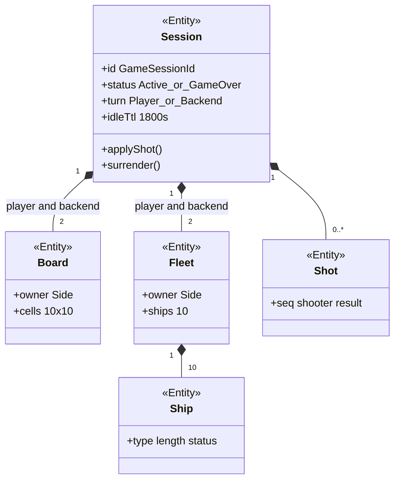

# Class: агрегат Session (слайд)

**Тип:** classDiagram  
**Срез:** одна схема корня Session. Полная модель: [diagram-class-001.md](diagram-class-001.md) (A0148).  
**Статус:** черновик витрины.

## Источники

Доменная модель, §7.1 канонической class-диаграммы. Службы `StartSession` и heatmap на слайд не вынесены.

---

Игроку на API отдаётся только `playerFleet`. Связи Registry / Ledger — на канонической схеме 7.2.

**Проверено:** латиница id классов; UI не классами.
