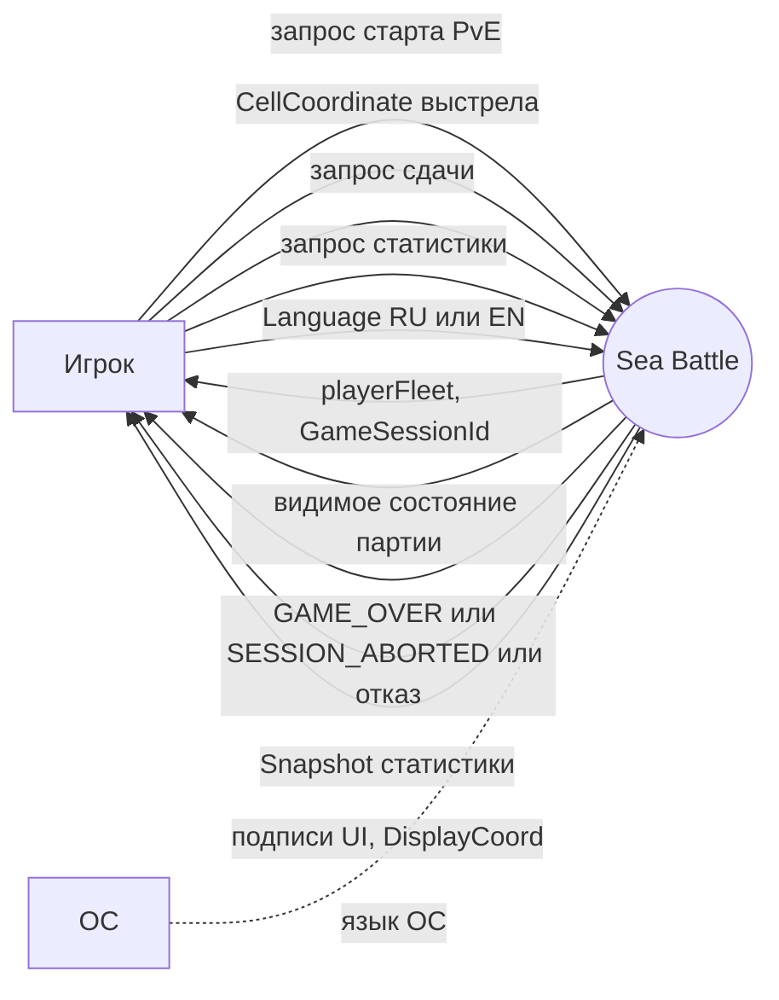
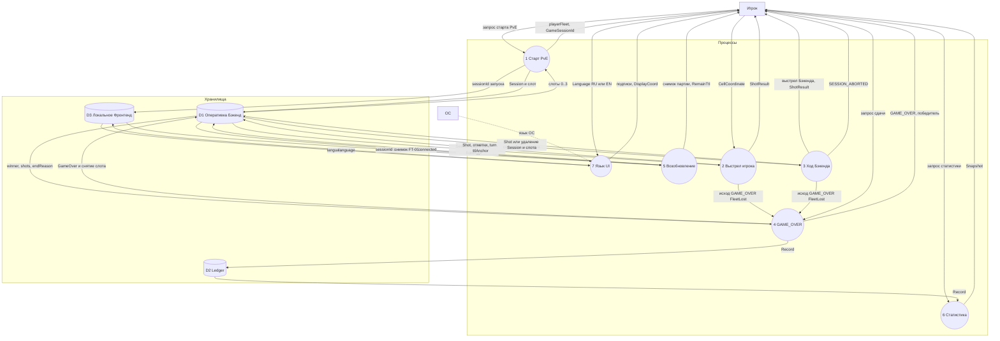

# DFD: потоки данных Sea Battle (уровни 0 и 1)

**Тип:** DFD (Mermaid flowchart)  
**Срез:** продукт Sea Battle (Фронтенд + Бэкенд), MVP PvE  
**Статус:** `Черновик, требует согласования`  
**Дата:** 2026-08-25

---

## Источники

- [Доменная модель](../requirements/domain-model.md) — агрегаты `Session`, `Registry`, `Ledger`, `Settings`, `Runtime`; служба `HeatmapBot` (агрегата нет)
- [Реестр Use Cases](../requirements/use-cases/list-uc.md) — UC-001…UC-008
- [UC-001](../requirements/use-cases/uc-001-start-pve-session.md) … [UC-008](../requirements/use-cases/uc-008-change-language.md)
- Термины: [глоссарий](../requirements/glossary.md)

**Приоритет фактов:** `Axxxx` и согласованные ФТ важнее предварительного ТЗ.

---

## 1. Внешние сущности

В UC акторами сценариев названы Игрок, Фронтенд и Бэкенд. В DFD **внутренняя система не рисуется внешней сущностью**: Фронтенд и Бэкенд — процессы и хранилища внутри границы продукта Sea Battle.

| Сущность | Тип | Почему внешняя | Откуда |
| --- | --- | --- | --- |
| Игрок | человек | Единственный человек-участник; инициирует старт, выстрел, сдачу, статистику, смену языка | UC-001, UC-002, UC-005, UC-007, UC-008 (primary); UC-003, UC-004, UC-006 (interested) |
| ОС | внешняя среда | Язык первого запуска UI, если RU или EN; иначе EN | UC-008 [Шаг 0.1], FT-060, агрегат `Settings` |

**Не внешние сущности (внутри системы):**

| Участник UC | Роль в DFD | Почему |
| --- | --- | --- |
| Фронтенд | процессы P5, P7 + хранилище D3 | BC Frontend: `Settings`, `Runtime`; primary в UC-006 |
| Бэкенд | процессы P1–P4, P6 + хранилища D1, D2 | BC Session / Heatmap / Statistics |

**Намеренно вне диаграммы:** PvP, логин, персональная статистика, ручная расстановка (вне MVP). Отдельного актора «время» в UC нет: idle TTL — условие по `ttlAnchor` агрегата `Session`.

---

## 2. Процессы преобразования (уровень 1)

Семь логических пакетов по UC. UC-005 не выделен отдельно: сдача — вход в тот же процесс фиксации `GAME_OVER`, что и уничтожение флота (include UC-004). `HeatmapBot` не отдельный процесс: расчёт `Aim` живёт только внутри хода Бэкенда и **не пишется** в хранилище (FT-050, A0095).

| ID | Процесс | Преобразует | UC | Домен |
| --- | --- | --- | --- | --- |
| P1 | Создать сессию PvE | запрос старта → `Session` + слот `Registry` + `Runtime.sessionId`; Игроку — только `playerFleet` и `GameSessionId` | UC-001 | `StartSession`, генерация флотов |
| P2 | Применить выстрел Игрока | `CellCoordinate` + снимок `Session` → `Shot`, отметки, `turn`, `ttlAnchor`; при конце флота Бэкенда — исход в P4 | UC-002 | методы корня `Session` |
| P3 | Выполнить ход Бэкенда | снимок поля Игрока → `Heatmap`/`Aim` (внутри процесса) → `Shot` по полю Игрока; пустая heatmap → FT-052 или `SESSION_ABORTED`; TTL/abort снимают слот **без** `Ledger` | UC-003 | `HeatmapBot.aim` + `Session` |
| P4 | Зафиксировать GAME_OVER и статистику | исход конца (`FleetLost` или сдача) → `Session.status = GameOver`, одна `Record` в `Ledger`, слот снят сразу | UC-004, вход UC-005 | `Session` + `Ledger` (A0129) |
| P5 | Возобновить соединение | `Runtime.sessionId` → снимок FT-002; TTL **не** сдвигается; отказ — единый «сессия недоступна» | UC-006 | `Runtime`, `Session.connected` |
| P6 | Выдать снимок статистики | записи `Ledger` → `Snapshot`; партия и TTL не меняются | UC-007 | `Ledger` |
| P7 | Сменить язык интерфейса | `Language` RU/EN → `Settings`; `DisplayCoord` на экране; `Session` и коды клеток не меняются | UC-008 | `Settings` |

---

## 3. Хранилища данных

Логические, укрупнены для MVP (согласовано): пять корней DDD → **три** хранилища DFD. В доменной модели `Registry` остаётся отдельным корнем из‑за инварианта «≤ 3» (A0143); на DFD слоты входят в оперативку Бэкенда. В D3 язык персистентен, `sessionId` запуска — эфемерен (A0132).

| ID | Хранилище | Состав (корни DDD) | Писатели | Читатели |
| --- | --- | --- | --- | --- |
| D1 | Оперативное состояние Бэкенда | `Session` (поля, флоты, `shots`, `turn`, `status`, `ttlAnchor`, `connected`) + слоты `Registry` (0…3 `GameSessionId`) | P1, P2, P3, P4, P5 | P1, P2, P3, P4, P5 |
| D2 | Ledger | набор `Record` (`sessionId`, `winner`, `shots`, `endReason`); `Snapshot` — производная | только P4 при `GAME_OVER` | P6 |
| D3 | Локальное состояние Фронтенда | `Settings.language` (персистентно) + `Runtime` (`sessionId` запуска, флаги pending — эфемерно) | P1 (`sessionId`); P7 (`language`); P2/P4 (флаги — на схеме упрощены) | P5, P7 |

**Не хранилище:** матрица `Heatmap` и VO `Aim` — считаются в P3 и отбрасываются; в FT-002 не входят.

---

## 4. Каталог потоков данных

Подпись на диаграмме сокращена; полный состав — в колонке «Данные». Игроку **не** уходят `backendFleet`, heatmap, Hunt/Target (FT-014, FT-015, FT-050).

### 4.1. Уровень 0 (контекст)

| От | К | Данные |
| --- | --- | --- |
| Игрок | Sea Battle | запрос старта PvE |
| Игрок | Sea Battle | `CellCoordinate` выстрела (коды клеток, не экранные буквы) |
| Игрок | Sea Battle | запрос сдачи (после «Вы уверены?») |
| Игрок | Sea Battle | запрос снимка статистики |
| Игрок | Sea Battle | `Language` RU/EN |
| Sea Battle | Игрок | `playerFleet`, `GameSessionId` (без флота Бэкенда и heatmap) |
| Sea Battle | Игрок | видимое состояние: отметки полей, `turn`, `RemainTtl`, `ShotResult` |
| Sea Battle | Игрок | `GAME_OVER` + победитель; либо `SESSION_ABORTED` / «сессия недоступна» / отказ старта |
| Sea Battle | Игрок | `Snapshot` (`games`, `playerWins`, `backendWins`, `avgShots`) |
| Sea Battle | Игрок | подписи UI и `DisplayCoord` |
| ОС | Sea Battle | язык ОС (RU/EN или «иной» → EN) — пунктир, только первый запуск |

Возобновление канала (UC-006) на уровне 0 **не** отдельная стрелка от Игрока: primary — Фронтенд внутри системы; Игрок получает уже видимое состояние / отказ.

### 4.2. Уровень 1

| От | К | Данные | Источник |
| --- | --- | --- | --- |
| Игрок | P1 | запрос старта PvE | UC-001 |
| P1 | Игрок | `playerFleet`, `GameSessionId`; отказ FT-049 / таймаут генерации | UC-001 шаги 5–6, 2.3 |
| D1 | P1 | слоты `GameSessionId` (0…3) | Registry, FT-004 |
| P1 | D1 | новая `Session` + `GameSessionId` в слот (только после выдачи расстановки) | UC-001 шаги 3–4, 7; FT-010, A0081 |
| P1 | D3 | `sessionId` текущего запуска | A0132, Runtime |
| Игрок | P2 | `CellCoordinate` выстрела по полю Бэкенда | UC-002 |
| D1 | P2 | `Session`: `turn`, `status`, `backendBoard`, непроверенные клетки | UC-002 шаг 2 |
| P2 | D1 | `Shot` (`seq`, `shooter = Player`, `coords`, `result`), отметки, `turn`, `ttlAnchor` | UC-002 шаги 3–4 |
| P2 | Игрок | `ShotResult` `MISS`/`HIT`/`SUNK`, периметр как `MISS` при `SUNK` | UC-002 шаги 6–7 |
| P2 | P4 | исход `GAME_OVER` (`endReason = FleetLost`, победа Игрока) | UC-002 шаг 5, include UC-004 |
| D1 | P3 | снимок поля Игрока: отметки, ранения, оставшиеся корабли, `turn = Backend` | HeatmapBot, UC-003 шаги 1–2 |
| P3 | D1 | `Shot` Бэкенда, отметки, `turn`, `ttlAnchor` **или** удаление сессии и слота (TTL / `SESSION_ABORTED`) | UC-003 шаги 4–5; FT-053; FT-075 |
| P3 | Игрок | событие выстрела Бэкенда, `ShotResult`, смена хода (heatmap не передаётся) | UC-003 шаг 7, FT-036 |
| P3 | Игрок | `SESSION_ABORTED` (пустая heatmap, флот Игрока жив) | UC-003 E1, FT-076 |
| P3 | P4 | исход `GAME_OVER` (`FleetLost`, победа Бэкенда; в т.ч. FT-052) | UC-003 шаги 6, 2.2 |
| Игрок | P4 | запрос сдачи | UC-005 |
| D1 | P4 | `winner`, `shots` (число `Shot`), `endReason` | UC-004 шаг 1, 3 |
| P4 | D1 | `status = GameOver` + снятие слота сразу; длительное хранение снимка не требуется | A0128, A0142, A0118 |
| P4 | D2 | одна `Record`: `sessionId`, `winner`, `shots`, `endReason` | UC-004 шаг 3, A0129 |
| P4 | Игрок | `GAME_OVER`, победитель | UC-004 шаг 4–5 |
| D3 | P5 | `sessionId` запуска | UC-006 шаг 1 |
| D1 | P5 | снимок FT-002: поля, история `shots`, `turn`, остаток idle TTL | UC-006 шаг 3 |
| P5 | D1 | `connected`: замещение соединения того же запуска | A0133, FT-068 |
| P5 | Игрок | видимый снимок партии, `RemainTtl` **или** «сессия недоступна» | UC-006 шаги 5–6, FT-067 |
| Игрок | P6 | запрос статистики | UC-007 |
| D2 | P6 | записи `Record` / агрегаты | UC-007 шаг 2 |
| P6 | Игрок | `Snapshot` | UC-007 шаг 3 |
| Игрок | P7 | выбор `Language` RU/EN | UC-008 |
| ОС | P7 | язык ОС (пунктир) | FT-060 |
| D3 | P7 | сохранённый `language` | A0136 |
| P7 | D3 | `language` | FT-062 |
| P7 | Игрок | подписи UI, `DisplayCoord` | UC-008 шаги 3–4 |

Внутри P3 без стрелки на схему: `Heatmap` + `Aim` (`Picked`/`Empty`) — создаются из снимка D1 и сразу потребляются; в хранилище не пишутся.

---

## 5. Проверка происхождения данных

Ничто на стрелках не появляется «из ниоткуда»: либо вход от внешней сущности, либо чтение хранилища, либо результат преобразования процесса (генерация по правилам источника).

| Данные | Откуда берутся | Кто пишет хранилище | Не противоречит |
| --- | --- | --- | --- |
| `playerFleet` / `backendFleet` | генерация в P1 по FT-010…FT-013 (вход — запрос старта, не готовый флот снаружи) | P1 → D1 | Игроку уходит только `playerFleet` (FT-014) |
| `GameSessionId` | выдаётся P1 после успешного старта | P1 → D1 (сессия + слот), P1 → D3 (копия в Runtime) | нет сессии до выдачи расстановки (A0081) |
| слот Registry | только после успешного P1 | P1 пишет в D1; P3/P4 снимают в D1 | четвёртый слот не создаётся (FT-049); в DDD корень отдельный (A0143), на DFD — часть D1 |
| `Shot` Игрока | координата от Игрока + применение к `backendBoard` | P2 → D1 | отказ без мутации при неверном канале/ходе (FT-055, FT-046) |
| `Shot` Бэкенда | `Aim` из снимка поля Игрока в P3, не от Игрока | P3 → D1 | клиент не стреляет по полю Игрока (UC-003 §5.4) |
| `Heatmap` / Hunt/Target | только внутри P3 | никто (не D1) | Игроку не передаётся (FT-050) |
| `Record` / счётчики | только из `Session` в момент `GAME_OVER` | только P4 → D2 | TTL, обрыв, `SESSION_ABORTED` записей не создают (FT-056) |
| `Snapshot` | производная от набора `Record` | не хранится отдельно | P6 только читает; TTL не сдвигает (UC-007) |
| `Language` | Игрок (меню) или ОС (первый запуск) | P7 → D3 | Бэкенд язык не хранит (A0091); D1 не меняется (FT-073) |
| `DisplayCoord` | функция `(CellCoordinate, Language)` | не в D1 | коды клеток сессии не меняются |
| `Runtime.sessionId` | копия id, выданного P1 | P1 → D3 | после рестарта приложения пусто (A0093); P5 без id снаружи |
| `RemainTtl` | `idleTtl` минус время с `ttlAnchor` | источник истины D1 | возобновление и статистика якорь не двигают |
| удаление сессии без `Ledger` | idle TTL или `SESSION_ABORTED` в P3 | P3 → D1 (сессия + слот) | нет `GAME_OVER` (FT-053, FT-075); D2 не трогается |

**Допущение схемы (не факт ТЗ):** истечение idle TTL на ходе Игрока нарисовано тем же P3 (контроль TTL при обращении к `Session`), чтобы не вводить восьмой процесс; инвариант — FT-053, явно в UC-003 [Шаг 1.2] и UC-006 [Шаг 2.1].

---

## 6. Уровень 0 — контекстная диаграмма

Один процесс всей системы. Хранилища и внутренняя декомпозиция не показываются.

---

## 7. Уровень 1 — декомпозиция

Процессы — круги; внешние сущности — прямоугольники; хранилища — цилиндры. Согласовано с уровнем 0: те же внешние сущности и те же внешние данные; возобновление — внутренний P5.

---

## 8. Замечания

- Укрупнение хранилищ: D1 = `Session` + слоты `Registry`; D2 = `Ledger`; D3 = `Settings` + `Runtime`. Различие персистентности в D3 — в §3, не отдельным цилиндром.
- Флаги `shotPending` / `surrenderPending` (A0116, A0131) пишутся в D3 процессами P2/P4; на схеме не вынесены, чтобы не дублировать команды Игрока.
- Отказ P5 «сессия недоступна» на рисунке входит в поток «снимок партии, RemainTtl» как альтернативный исход того же канала к Игроку; раздельно назван в таблице §4.2.
- JSON статистики (A0134) и ключи локализации (A0137) на DFD не детализируются.
- As-is / to-be не смешивались: только MVP по текущим UC и модели.

**Проверено (§2.4, §6):** внешние сущности из UC учтены, Фронтенд/Бэкенд внутри границы; 7 процессов трассируются к UC-001…008; каждая стрелка именована данными; L0 и L1 согласованы; таблица происхождения заполнена; нотация процесс/сущность/хранилище соблюдена; уровни в разных блоках Mermaid; id узлов — латиница; heatmap и флот Бэкенда к Игроку не проведены; три хранилища согласованы с заказчиком.
