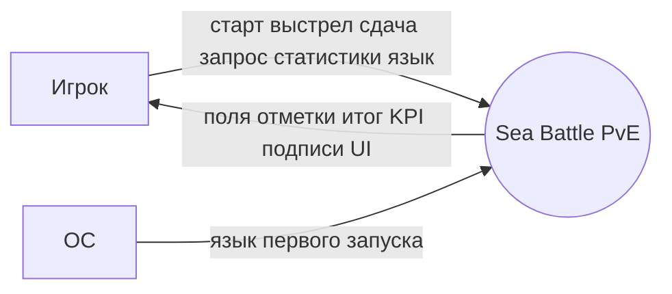

# DFD уровень 0 — обзор для витрины

**Тип:** DFD context  
**Срез:** продукт как один процесс. Декомпозиция: [diagram-dfd-001.md](diagram-dfd-001.md) (черновик аналитика, уровни 0 и 1).  
**Статус:** черновик витрины.

## Источники

Те же, что канонический DFD: Игрок и ОС внешние; Фронтенд и Бэкенд внутри системы.

## Происхождение данных (кратко)

Расстановки и выстрелы возникают из действий Игрока и расчёта Бэкенда; статистика — только из завершённых партий; язык — из ОС или выбора Игрока, хранится на клиенте.

---

**Проверено (§2):** один процесс на уровне 0; стрелки — данные; хранилища на уровне 0 не обязательны. Heatmap наружу не течёт.
