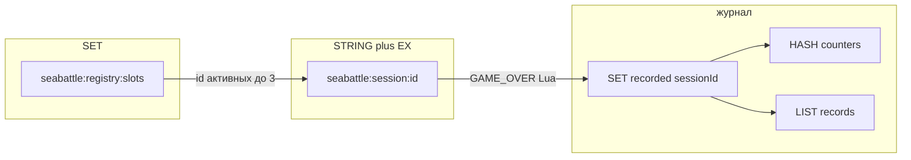

# Ключи Redis (вместо ER)

**Тип:** flowchart связей ключей  
**Срез:** инфраструктура as-is `redis_session_store.py`, `redis_ledger_store.py`.  
**Статус:** черновик витрины.

SQL/ER нет. Heatmap ключа не имеет.

---

Lua старта: SCARD слотов < 3, SADD, SET JSON EX. Lua исхода: SISMEMBER recorded, иначе LPUSH + HINCRBY.
