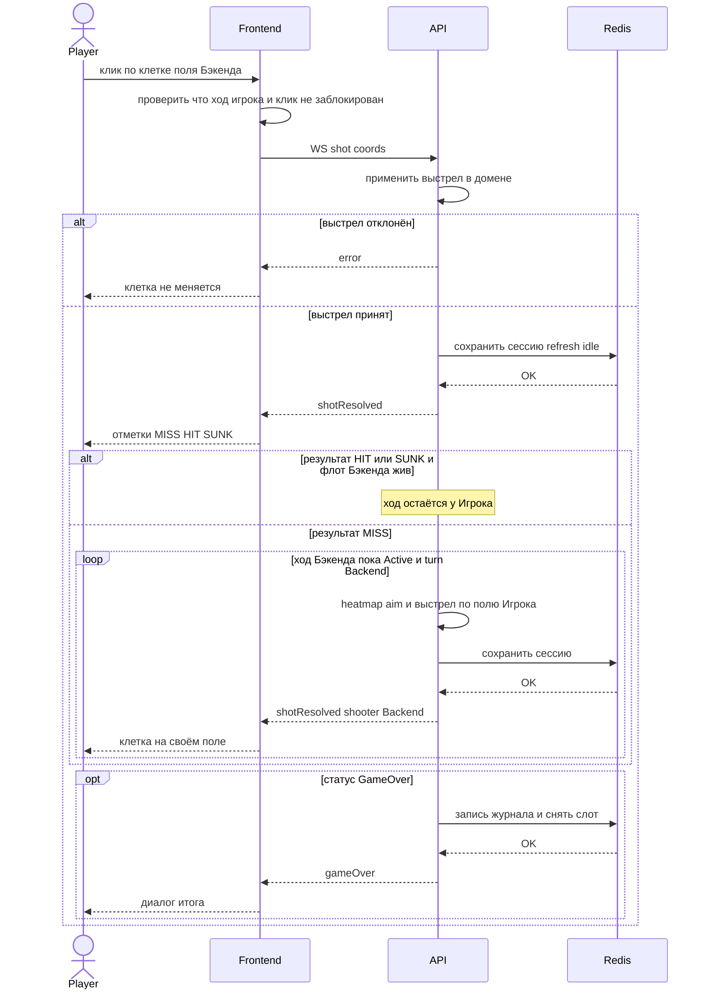

# Sequence: выстрел игрока и ход Бэкенда

**Тип:** sequenceDiagram  
**Срез:** UC-002 + UC-003 на уже открытом канале партии (старт UC-001 вне диаграммы).  
**Статус:** черновик витрины для согласования.

## Источники

- [uc-002-player-shot.md](../requirements/use-cases/uc-002-player-shot.md)
- [uc-003-backend-turn-and-state.md](../requirements/use-cases/uc-003-backend-turn-and-state.md)
- [src/backend/presentation/ws.py](../src/backend/presentation/ws.py)
- [src/backend/application/play_backend_turns.py](../src/backend/application/play_backend_turns.py)
- OpenAPI: WS `shot` / `shotResolved` / `gameOver`; REST shots — отказ (вне основного потока)

**Намеренно вне диаграммы:** handshake и `sessionSnapshot`; сдача; reconnect; REST-выстрел; пустая heatmap abort; цикл более 20 выстрелов Бэкенда (защитный лимит кода).

Участники: Игрок, Фронтенд, API (один процесс FastAPI), Redis.

## Проверка §4.6 (до Mermaid)

| Пункт | Заключение |
| --- | --- |
| 4.6.1 останов очереди в loop | Серия хода Бэкенда — `loop` только пока ход у Бэкенда и партия Active; выход из loop без `break` внутри. `GAME_OVER` после loop в `opt`. |
| 4.6.2 дубль запроса в else | Ветки `alt` по результату выстрела игрока полные: HIT/SUNK vs MISS. Нет повторного `shot` в else. |
| 4.6.3 флаг перед внешним | Перед записью Redis — применение выстрела в домене (самовызов API). Отказ нелегального выстрела — кадр `error`, без persist игровой мутации. |
| 4.6.4 вложенность | Один внешний `alt` (отклонён / принят) + внутри успеха второй `alt` (HIT vs MISS) и `loop` в ветке MISS; `opt` GAME_OVER внутри внешней ветки успеха. Вложенность `alt` = 2. `end` посчитаны. |
| 4.6.5 реальное время | Нет Docker/bat. |
| 4.6.6 нулевые итерации | Loop хода Бэкенда в ветке MISS: минимум один проход aim. Склейки частичного результата нет. |
| 4.6.7 счёт end | Открытия: `alt` 2, `opt` 1, `loop` 1 → **4** `end`. |

Арифметика: alt(2) + opt(1) + loop(1) = 4 end.

---

**Проверено:** §4.6 (таблица выше), §4.5, §6 п.8. Пояснения перед fence. Идентификаторы участников латиница.
