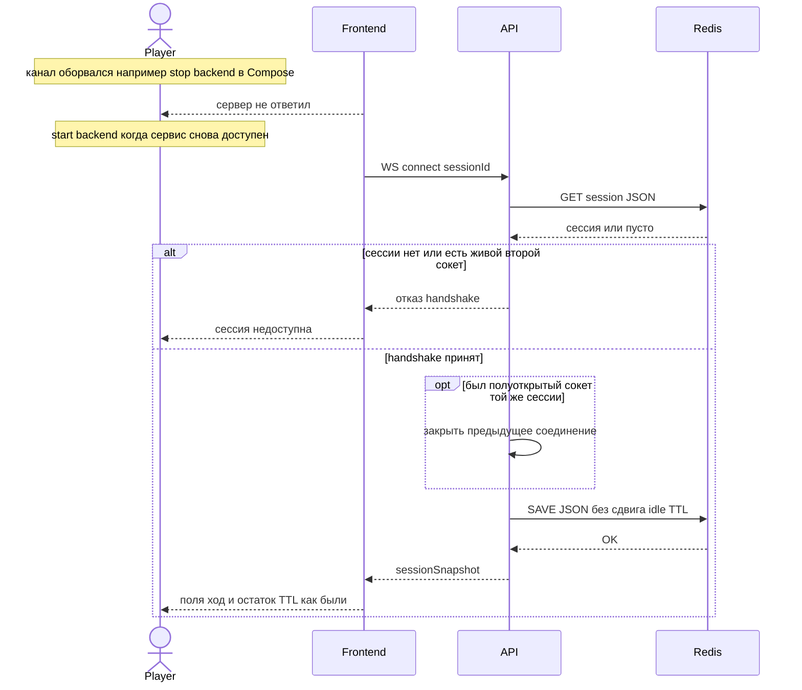

# Sequence: возобновление канала партии

**Тип:** sequenceDiagram  
**Срез:** UC-006, S-07; id сессии уже в памяти процесса Фронтенда.  
**Статус:** черновик витрины для согласования.

## Источники

- [uc-006-resume-session.md](../requirements/use-cases/uc-006-resume-session.md)
- A0093, A0132, FT-005, FT-068
- [src/backend/presentation/ws.py](../src/backend/presentation/ws.py) (`replace` полуоткрытого, отказ живому второму)
- [src/backend/application/ports.py](../src/backend/application/ports.py) `refresh_idle=False`

**Намеренно вне диаграммы:** ввод id пользователем (в MVP нет); истечение TTL (`ttlExpired`); GAME_OVER handshake 404.

Участники: Игрок наблюдает окно; Фронтенд; API; Redis.

Долгое действие «контейнер backend недоступен» — `Note over Player`, не стрелка в API (§4.6.5).

## Проверка §4.6 (до Mermaid)

| Пункт | Заключение |
| --- | --- |
| 4.6.1 | Нет очереди элементов. Handshake — один `alt`. |
| 4.6.2 | Ветки отказа / успеха handshake полные, без второго connect в else. |
| 4.6.3 | API читает сессию из Redis до accept; отказ без accept — нет persist. Успех: `connected=True`, `save` без refresh idle. |
| 4.6.4 | Один `alt` handshake; внутри успеха `opt` закрыть полуоткрытый сокет (внутреннее, не второй клиент). Вложенность 1. |
| 4.6.5 | Обрыв сервера — Note, затем отдельная попытка Фронтенда. |
| 4.6.6 | Нет loop склейки. |
| 4.6.7 | `alt` 1 + `opt` 1 = **2** `end`. |

---

**Проверено:** §4.6, §6 п.8. Фазы `==` не использовались внутри фрагментов.
