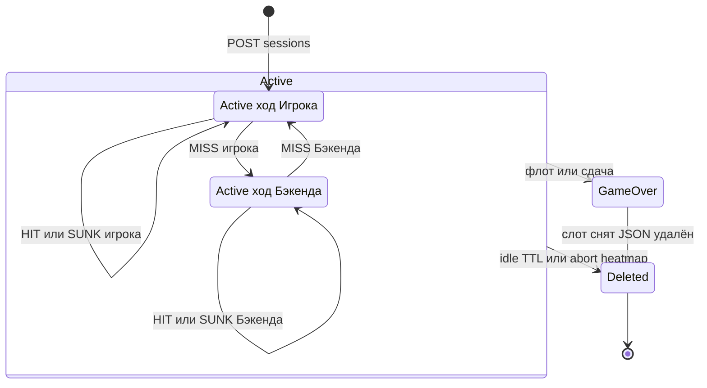

# Состояния игровой сессии

**Тип:** stateDiagram-v2  
**Срез:** агрегат Session + удаление ключа Redis (не отдельный enum).  
**Статус:** черновик витрины для согласования.

## Источники

- [src/backend/domain/types.py](../src/backend/domain/types.py): `SessionStatus` = `Active` | `GameOver`
- [src/backend/domain/shot.py](../src/backend/domain/shot.py), [surrender.py](../src/backend/domain/surrender.py)
- FT-004/053/066/075, A0128, A0145
- Ход: `Side` Player | Backend при `Active`

В коде нет статуса `Aborted`. Прерывание heatmap и idle TTL **удаляют** ключ; журнала нет.

## Переходы

| Из | В | Триггер |
| --- | --- | --- |
| нет | Active, ход Игрока | успешный `POST /sessions` |
| Active, ход Игрока | Active, ход Игрока | принятый HIT/SUNK, флот Бэкенда жив |
| Active, ход Игрока | Active, ход Бэкенда | принятый MISS |
| Active, ход Бэкенда | Active, ход Бэкенда | HIT/SUNK Бэкенда, флот Игрока жив |
| Active, ход Бэкенда | Active, ход Игрока | MISS Бэкенда |
| Active | GameOver | флот уничтожен или сдача |
| GameOver | ключ удалён | после доставки `gameOver` (A0145) |
| Active | ключ удалён | idle TTL `ttlExpired` или `sessionAborted` |

---

**Проверено:** вложенность Active отражает `turn`, не третий enum; Deleted — инфраструктура. §6: id состояний латиница.
