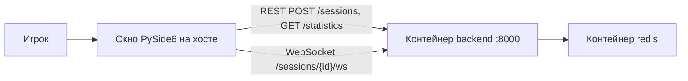

# Sea Battle — запуск на другом компьютере (без Cursor)

Инструкция для ревьюера: как скачать репозиторий и запустить живую партию «Морской бой». **Cursor, агенты и slash-команды не нужны.** Это среда разработки автора, не зависимость продукта.

Репозиторий: [https://github.com/ILikeWorkingIT/SeaBattle](https://github.com/ILikeWorkingIT/SeaBattle)

## Что должно получиться

Два процесса:

1. **Сервер** — два контейнера Docker: `redis` (состояние партий и статистика) и `backend` (FastAPI + Uvicorn, порт **8000**).
2. **Клиент** — обычное десктопное окно PySide6 на хосте (не браузер и не контейнер). Заголовок: **Sea Battle — PvE**. Клиент ходит на `http://localhost:8000` (REST) и `ws://localhost:8000/sessions/{id}/ws` (выстрелы и сдача).



Окно без Docker откроется, но живую партию не начнёт: сервер не ответит.

## Что установить заранее

| Что | Зачем | Как проверить |
| --- | --- | --- |
| [Docker Desktop](https://www.docker.com/products/docker-desktop/) (Windows / macOS) или Docker Engine + Compose v2 (Linux) | Контейнеры `redis` и `backend` | `docker version` и `docker compose version` |
| Python **3.12 или новее** на хосте | Окно игры (PySide6) | `python --version` / `python3 --version` |
| Git | Клонирование | `git --version` |

На Windows для GUI нужен **нативный** Python (installer с python.org или Microsoft Store). Python из WSL окно на рабочий стол не выведет так же удобно, как обычный Windows Python.

Свободный порт **8000** на машине. Если занят — либо остановите чужой процесс, либо временно смените проброс в `docker-compose.yml` (`"8000:8000"` → `"18000:8000"`) и задайте клиенту `SEA_BATTLE_API_URL=http://localhost:18000`.

RAM: достаточно типичных 8 ГБ; Docker Desktop лучше не держать в режиме «2 ГБ и меньше».

## Что не нужно

- Cursor, VS Code, плагины.
- `.env` **не обязателен**, если на диске есть каталог по умолчанию `F:/Docker/Redis`. Иначе одна переменная `REDIS_DATA_DIR` (шаг 1). `REDIS_URL` / `HOST` / `PORT` для контейнера `backend` Compose задаёт сам.
- Публиковать Redis на хост: у `redis` нет `ports`, он доступен только внутри сети Compose как `redis:6379`.
- Образ с Docker Hub для бэкенда: он **собирается из** `src/backend/Dockerfile`.
- GitHub Release, `.exe`, установщик: продукт запускается из исходников.

## 0. Скачать код

Рабочий MVP — ветка **`main`** и тег **`v1.0.0`** (одно состояние на момент публикации). Cursor не нужен.

```powershell
git clone https://github.com/ILikeWorkingIT/SeaBattle.git
cd SeaBattle
```

Только снимок 1.0.0 (если когда-нибудь `main` уйдёт вперёд):

```powershell
git clone --branch v1.0.0 https://github.com/ILikeWorkingIT/SeaBattle.git
cd SeaBattle
```

В корне должны быть `docker-compose.yml` и папка `src/`. Репозиторий публичный: отдельный доступ к clone не нужен.

## 1. Каталог данных Redis на хосте

Контейнер `redis` пишет файлы на диск компьютера (bind mount в `/data` внутри контейнера). YAML править не нужно.

| Кто | Что сделать |
| --- | --- |
| Есть диск `F:` и папка как у автора | Ничего. По умолчанию используется **`F:/Docker/Redis`**. |
| Другой диск, другая папка, нет `F:`, macOS / Linux | Задать `REDIS_DATA_DIR` — любой существующий или создаваемый каталог. |

Создайте в **корне** репозитория файл `.env` (его нет в Git). Одна строка достаточно:

```env
REDIS_DATA_DIR=D:/docker/redis
```

Относительный путь от корня репозитория тоже годится:

```env
REDIS_DATA_DIR=./data/redis
```

Windows PowerShell без `.env`:

```powershell
$env:REDIS_DATA_DIR = "D:/docker/redis"
docker compose up --build
```

Linux / macOS:

```bash
export REDIS_DATA_DIR="$HOME/docker/seabattle-redis"
docker compose up --build
```

Пишите путь в POSIX-стиле (`D:/docker/redis`, не `D:\docker\redis`). Каталог Docker Desktop обычно создаёт сам; если родительского диска нет — задайте другой `REDIS_DATA_DIR`.

Рабочий `.env` не коммитьте. Образец комментариев — `.env.example`.

## 2. Поднять контейнеры

Docker Desktop должен быть запущен (иконка в трее, движок Ready).

Из **корня** репозитория (там, где `docker-compose.yml`):

```powershell
docker compose up --build
```

Первый запуск качает `redis:7-alpine` и `python:3.12-slim`, затем ставит зависимости из `src/backend/requirements.txt` и собирает образ `backend`. Это может занять несколько минут.

Ожидаемые сервисы:

| Сервис Compose | Образ / сборка | Роль | Порт на хосте |
| --- | --- | --- | --- |
| `redis` | `redis:7-alpine` | Сессии (idle TTL 30 мин, лимит 3 слота) и глобальная статистика | нет |
| `backend` | сборка `src/backend/Dockerfile` | FastAPI, REST + WebSocket | **8000** |

`backend` ждёт healthy у Redis (`redis-cli ping`), затем стартует Uvicorn: `backend.main:app` на `0.0.0.0:8000`.

Оставить терминал открытым (логи) или уйти в фон:

```powershell
docker compose up --build -d
docker compose ps
```

Оба сервиса должны быть `running` / `healthy`.

### Проверка API без окна игры

В браузере:

- живой Swagger бэкенда: [http://localhost:8000/docs](http://localhost:8000/docs)
- статистика (JSON, нули если партий ещё не было): [http://localhost:8000/statistics](http://localhost:8000/statistics)

Не путать с просмотрщиками YAML на портах **8080/8081** (см. ниже): это документация файла `requirements/openapi.yaml`, не сам сервер.

PowerShell:

```powershell
Invoke-RestMethod http://localhost:8000/statistics
```

Linux / macOS:

```bash
curl -s http://localhost:8000/statistics
```

Код 200 и поля вроде `games`, `playerWins` — сервер жив.

## 3. Поставить клиент и открыть окно

Один раз в виртуальном окружении (рекомендуется), из корня репозитория.

Windows PowerShell:

```powershell
python -m venv .venv
.\.venv\Scripts\Activate.ps1
python -m pip install --upgrade pip
pip install -r src\frontend\requirements.txt
```

Если политика запрещает скрипты: `Set-ExecutionPolicy -Scope Process -ExecutionPolicy Bypass`, затем снова `Activate.ps1`. Либо вызывайте `.\.venv\Scripts\python.exe` без активации.

Linux / macOS:

```bash
python3 -m venv .venv
source .venv/bin/activate
python -m pip install --upgrade pip
pip install -r src/frontend/requirements.txt
```

Зависимость клиента одна: `PySide6` (в пакете есть Qt WebSocket). Отдельный `httpx` для окна не требуется: REST идёт через стандартную библиотеку.

### Запуск окна

**Windows, самый простой путь:** в проводнике откройте папку `src` и дважды щёлкните `run-frontend.bat`. Скрипт выставляет `PYTHONPATH` на `src` и делает `python -m frontend`. Нужен тот `python`, где установлен PySide6 (после шага с `.venv` удобнее запуск из активированного окружения, см. ниже).

Если `.bat` открыл окно и сразу закрыл с ошибкой — Python в PATH не тот. Запускайте из терминала с активированным `.venv`:

Windows:

```powershell
cd src
$env:PYTHONPATH = (Get-Location).Path
python -m frontend
```

Из корня репозитория без смены каталога:

```powershell
$env:PYTHONPATH = (Resolve-Path .\src).Path
python -m frontend
```

Linux / macOS:

```bash
cd src
export PYTHONPATH="$(pwd)"
python3 -m frontend
```

Должно появиться окно **Sea Battle — PvE**, лобби «Морской бой», кнопка «Начать партию». Соперник на экране подписан **Компьютер** (это серверный ИИ, не отдельная программа).

Клиент по умолчанию бьёт в `http://localhost:8000`. Другой URL:

```powershell
$env:SEA_BATTLE_API_URL = "http://localhost:8000"
```

## 4. Сыграть одну партию (проверка, что всё связано)

1. В лобби нажмите **Начать партию**.
2. Появится своё поле с кораблями. Поле Компьютера **без** чужих палуб — так и задумано.
3. Клик по клетке поля Компьютера — выстрел игрока. Попадание: ход остаётся. Промах: ходит Компьютер, отметка появляется на вашем поле сама.
4. Меню **Вид → Статистика** (или кнопка статистики в лобби) — KPI с `GET /statistics`.
5. Завершение: уничтожить флот либо **Партия → Сдаться**.

Если сразу после «Начать партию» сообщение вроде «Сервер не ответил» — контейнер `backend` не слушает `:8000` (шаг 2). Окно при этом уже работает.

Лимит: **три** активные сессии на сервер. Четвёртая получит отказ («Нет свободного слота»). Простой 30 минут без ходов освобождает слот (idle TTL); ждать в демо не обязательно.

Полный перезапуск `.bat` / нового процесса **не** подхватывает старую сессию. Пока окно не закрыто, обрыв `backend` и его `docker compose start backend` партия умеет переживать (reconnect).

## 5. Остановка

В каталоге с `docker-compose.yml`:

```powershell
docker compose down
```

Контейнеры останавливаются, том Redis по умолчанию остаётся. Окно закройте крестиком.

Собрать заново после смены кода бэкенда: снова `docker compose up --build`.

## Дополнительно (не обязательно для партии)

### Просмотрщики контракта OpenAPI (YAML)

Это не игровой сервер. Скрипт поднимает статичные Swagger UI и ReDoc по файлу `requirements/openapi.yaml`.

Windows: дважды щёлкните `requirements/run-openapi-docs.bat`. Либо:

```powershell
cd requirements
python preview-openapi.py
```

По умолчанию: Swagger [http://127.0.0.1:8080/](http://127.0.0.1:8080/), ReDoc [http://127.0.0.1:8081/](http://127.0.0.1:8081/). Если порты заняты, скрипт печатает фактические URL.

**Try it out** в этом Swagger живой, только если уже поднят Compose-`backend` на `:8000`. Иначе будет ошибка соединения — это не дефект YAML.

Живой интерактивный API того же процесса, что играет с окном: [http://localhost:8000/docs](http://localhost:8000/docs).

### Автотесты

Docker и Redis **не** нужны: набор ходит в FastAPI через ASGI и подменяет хранилище в памяти.

Из корня, в том же venv:

```powershell
pip install pytest pytest-asyncio
pip install -r src\backend\requirements.txt
pip install -r src\frontend\requirements.txt
python -m pytest --tb=short
```

`pytest.ini` уже задаёт `pythonpath = src` и `testpaths = tests`. GUI в тестах не открывается.

Последний зафиксированный полный прогон в репозитории: 279 passed (`reports/test-run.md`). Цифра на вашей машине может чуть отличаться, если набор с тех пор меняли.

## Если что-то не стартует

| Симптом | Что проверить |
| --- | --- |
| `error mounting` / `F:/Docker/Redis` / путь не найден | Нет диска `F:`: задайте `REDIS_DATA_DIR` (шаг 1), YAML не трогайте |
| `docker: command not found` или `engine not running` | Docker Desktop запущен; в PowerShell новый сеанс после установки |
| `Bind for 0.0.0.0:8000 failed` | Порт занят: `netstat -ano | findstr :8000` (Windows) |
| `backend` рестартится, Redis unhealthy | `docker compose logs redis`; подождать healthcheck (~несколько секунд) |
| Сборка `backend` падает на `pip install` | Сеть до PyPI; повторить `docker compose up --build` |
| Окно не открылось, `.bat` мигнул | `python --version` ≥ 3.12; `pip show PySide6`; запускать из venv |
| `No module named frontend` | `PYTHONPATH` должен указывать на каталог `src`, не на корень репозитория |
| «Сервер не ответил» в окне | `docker compose ps`; открыть http://localhost:8000/docs |
| Пустой клон, нет `src/` | Не та ревизия: нужна ветка `main` или тег `v1.0.0` |
| Linux: `Could not load the Qt platform plugin` | Пакеты платформы Qt/xcb (зависит от дистрибутива), запуск не из headless SSH без дисплея |
| macOS: `python` — 3.9 от системы | Ставьте 3.12+ и вызывайте его явно (`python3.12`) |

Полезные логи:

```powershell
docker compose logs -f backend
docker compose logs -f redis
```

## Снимок для скрининга

Тег **`v1.0.0`** — MVP в этом виде (ветка `main`). GitHub Release с `.exe` не нужен. Канон запуска: clone → при отсутствии диска `F:` строка `REDIS_DATA_DIR` в `.env` → `docker compose up --build` → PySide6 → `src/run-frontend.bat`.

Не нужно: выкладывать `.env`, образы на Docker Hub, облако/HTTPS/логин, Redis на хосте рядом с Compose, Cursor.
