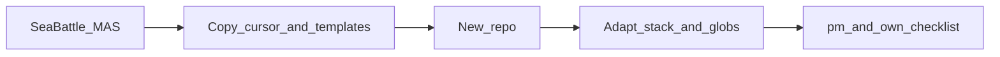

# Перенос MAS в другой проект

Операционный канон. Философия ролей и гейтов — `documentation/mas-description.md`. Этот файл копируют **вместе** с MAS, чтобы агент в целевом репозитории знал, что править.

Переносится методология (агенты, скиллы, правила, каркас отчётов), **не** продукт Sea Battle.

Скрипты-генераторы среды не использовать. Точка входа после копирования и адаптации — `/pm`.

## 1. Назначение и границы

Это перенос **готовой** MAS из репозитория-образца (Sea Battle) в другой репозиторий.

Это **не**:

- создание MAS с нуля — см. `documentation/mas-description.md` §11;
- инструкция запуска игры на чужой машине — `reports/instruction.md`, `reports/instruction-api.md`;
- копирование кода, требований, Vision, ГОСТ и истории срезов Морского боя.

**Предусловие:** целевой репозиторий готов принять ту же **каркасную** структуру папок: `requirements/`, `reports/`, `documentation/`, `artifacts/`, `diagrams/`; при разработке ПО — `src/`, `tests/`.

Две аудитории одного файла:

| Кто | Что делать |
| --- | --- |
| Человек или агент **в источнике** | Скопировать белый список, не трогать чёрный список, положить этот файл в цель |
| Агент **в целевом** репозитории | Прочитать §2 и §7, переписать стек-зависимые файлы, затем `/pm` |

Имена команд, скиллов и ролей унифицированы для проектов автора. Менять их без нужды не надо. Менять **обязан** стек, пути кода, globs правил и product-specific формулировки.

## 2. Карта слоёв — что зачем

Целевой агент правит файлы по назначению слоя, а не «на глаз». SOP этапа живёт в **скилле**, не в slash-команде.

| Слой | Путь | Зачем | Когда трогать после копирования |
| --- | --- | --- | --- |
| Custom Agents | `.cursor/agents/` | Промпты ролей Cursor (`agent-pm`, `agent-analyst`, …) | Убрать примеры Sea Battle / PySide6 / FastAPI; роль и манифест оставить |
| Глобальные правила | `.cursor/rules/rule-*.mdc` | Инварианты репозитория (структура, `Axxxx`, язык кода) | `rule-structure.mdc` — под новый продукт; `rule-python.mdc` — заменить или удалить при другом языке |
| Ролевые правила | `.cursor/rules/role-*.mdc` | Input Manifest роли (что читать/писать). Это инструкция модели, **не** ACL файловой системы | Поправить `globs` под каталоги цели (`src/frontend` → фактический UI) |
| Slash-команды | `.cursor/commands/` | Тонкая точка входа: роль, скилл, input/output | Описания стека в `/frontend`, `/app-layer`, `/pm` |
| Скиллы | `.cursor/skills/` | Плейбук исполнения. `disable-model-invocation: true` — сами не подхватываются, нужен slash / агент / явная просьба | Стек UI/API/тестов; конвейер ПМ, если нет фронта или бэка |
| Индекс | `.cursor/list-commands.md` | Актуальный список команд, скиллов, агентов | Обязательно, если менялись имена команд/скиллов; иначе почистить product-specific фразы |
| Инварианты агента | `AGENTS.md` | Факты, `Axxxx`, папки, MAS без плейбука одной роли | Имена продукта и канон ТЗ цели; не выдумывать `Specification.md` |
| Описание MAS | `documentation/mas-description.md` | Философия, роли, гейты, сценарии S1–S5 | Не раздувать; product-specific уже в навигаторе цели |
| Каркас структуры | `documentation/project-structure-v1-1.md` | Синхрон с `rule-structure.mdc` | Переписать под папки **этого** продукта |
| Навигатор | `reports/navigator.md` | «С чего начать» для ПМ | Блоки «Этот репозиторий сейчас», ТЗ, стек |
| Шаблоны отчётов | `reports/templates/` | Чистые заготовки `project-config`, `pm-state`, traceability, гейт, daily, backlog, commit-audit | Не заполнять данными Sea Battle |
| Стек и этап | `reports/project-config.md`, `reports/pm-state.md` | Декларация стека; текущий этап и APPROVED | **Не копировать** из источника. Создаёт `/pm` из шаблонов |
| Срезы кода | `reports/checklist.md` | Атомарные куски MVP **этого** продукта | **Не копировать**. ПМ создаёт под цель |
| Эта инструкция | `reports/instructions-copying.md` | Как перенести MAS дальше | Оставить как есть |

Связка четырёх слоёв Cursor: агент задаёт роль → `role-*.mdc` режет контекст → slash открывает этап → скилл выполняет работу. Пользователь в норме говорит с `pm`; прямые `/ft`, `/frontend` — сценарий **S5** (обычный чат), не срез чеклиста `S-05`. Команды `/full-cycle` нет.

## 3. Что копировать

Из корня репозитория-образца в корень цели (те же относительные пути):

| Что | Куда | Зачем |
| --- | --- | --- |
| Папка `.cursor/` целиком | корень цели | агенты, команды, скиллы, правила, `list-commands.md` |
| `AGENTS.md` | корень цели | инварианты агента, MAS, `Axxxx` |
| `documentation/mas-description.md` | `documentation/` | описание MAS |
| `documentation/project-structure-v1-1.md` | `documentation/` | каркас папок; **сразу** переписать под новый продукт |
| `reports/templates/` (все шаблоны) | `reports/templates/` | чистые заготовки отчётов |
| `reports/navigator.md` | `reports/navigator.md` | карта для ПМ; **переписать** product-specific блоки |
| `reports/instructions-copying.md` | `reports/instructions-copying.md` | этот канон — чтобы агент в цели мог адаптировать MAS |

Копировать файлы целиком. Не вырезать скиллы «на будущее»: проще оставить универсальные `/ft`…`/uc` и отключить слой в конвейере ПМ, чем собирать MAS заново.

## 4. Что не копировать

Чёрный список. Это продукт и история **Морского боя**, не методология.

| Что | Почему |
| --- | --- |
| `src/` | Код игры, PySide6, FastAPI, heatmap |
| `tests/`, `tests/coverage.md` | Автотесты чужого MVP |
| `pytest.ini` как канон чужого стека | Только Python+pytest; в цели — опциональный посев, см. §6 |
| `docker-compose.yml`, `.env`, `.env.example` источника | Redis, порты, `F:/Docker/Redis` машины автора |
| `Запуск Redis+backend.bat`, `Сбросить только партии.bat`, `src/run-frontend.bat` | Лаунчеры этого продукта |
| Весь `requirements/` продукта: ФТ, НФТ, глоссарий, DDD, словарь, OpenAPI Морского боя, `answers-project.md`, `user-stories/`, `use-cases/` | Пишутся командами `/ft`, `/nft`, `/us`, `/uc` и др. **в цели** |
| `artifacts/` | Vision, ГОСТ, скриншоты, витрина портфолио |
| `reports/checklist.md` | Срезы S-00…S-08 чужого MVP |
| `reports/project-config.md`, `reports/pm-state.md` | Стек и этап Sea Battle; `/pm` создаст из шаблонов |
| `reports/agent-memory.md` | Договорённости чужого проекта и пути `F:\Docker` |
| QC и прогоны: `incompatibility-*.md`, `domain-model-review.md`, `review-report.md`, `test-run.md` | История чужого гейта |
| `reports/instruction.md`, `reports/instruction-api.md` | Запуск окна и API Морского боя |
| `README.md`, `README.en.md` источника | Витрина продукта, не MAS |
| `__pycache__/`, `.pytest_cache/`, `.venv/` | Кэш, не артефакты |

Не копировать `legacy/`, `old-skills/`, `imports/` — их нет в Git источника, в цель они не входят.

## 5. Какие каталоги создать в цели

Пустые (или только с `.gitkeep`, если репозиторий иначе не видит папку):

- `requirements/` — при необходимости сразу подпапки `user-stories/`, `use-cases/`;
- `diagrams/`;
- `documentation/` — если ещё нет; положить черновик ТЗ или заметку со стеком (ПМ не выдумывает канон ТЗ);
- `artifacts/`;
- `reports/` — кроме уже скопированных `templates/`, `navigator.md`, `instructions-copying.md`; по желанию каркас `daily/`, `weekly/`, `release/`, `commit-audit/`.

При разработке ПО:

- `src/` (и принятая нарезка: frontend/backend или иная — зафиксировать в `rule-structure.mdc` **цели**);
- `tests/`;
- `test-data/` — только если пользователь явно завёл такую папку.

Имена папок после адаптации — по `rule-structure.mdc` цели, не по Морскому бою.

## 6. Опциональный посев (не слепое копирование)

Можно взять как **заготовку** и сразу вычистить чужой язык/инструменты:

| Файл источника | Когда брать | Что сделать в цели |
| --- | --- | --- |
| `.gitignore` | Почти всегда | Оставить секреты (`.env`), `legacy/` / `old-skills/` / `imports/`; Python-кэш — только если Python; не тащить Redis `/data/` без Redis |
| `.cursorignore` | Почти всегда | Те же исключения `legacy/` и кэш; добавить игнор стека цели (`node_modules/`, `target/` и т.п.) |
| `pytest.ini` | Только Python + pytest | Иначе завести конфиг раннера цели (`package.json` scripts, `go test`, …) и отразить его в `skill-use-tests` |

`.env.example` источника не копировать. Если в цели есть сервисы — написать свой пример без секретов.

## 7. Плейбук для агента в целевом проекте

Ты в **другом** репозитории. Файлы MAS скопированы из Sea Battle. Морской бой, PySide6, FastAPI, Redis, heatmap, `specification-sea-battle-v1-1.md` — **не** факты этой цели, пока пользователь или `documentation/` цели это не подтвердили.

### 7.1. Сначала факты цели

1. Прочитай `documentation/` **этого** репозитория и явные указания пользователя. Нет черновика ТЗ — попроси его или короткий README со стеком. Не выдумывай `Specification.md`.
2. Определи сценарий MAS: **S1** (новый, без требований), **S2** (код есть, требований нет), **S3** (есть и код, и описание).
3. Не подставляй домен «флот / выстрел / партия» и подписи «Компьютер vs Бэкенд».
4. Путь `F:\Docker\…` и bind `F:/Docker/Redis` — машина автора образца. Том и диск брать из цели / её `.env.example`, не копировать как догму.

### 7.2. Что почти не менять

Методология. Править только имена продукта и пути, не выкидывать процесс.

- скиллы и команды: `/ft`, `/nft`, `/us`, `/uc`, `/qc-ft-nft`, `/qc-us-uc`, `/ddd`, `/qc-ddd`, `/data-dictionary`, `/diagram-bpmn`, `/diagram-mermaid`, `/vision`, `/gost-3460289`, `/pin-memory`, `/qc-stage`;
- правила: `rule-answers-project.mdc`, `rule-analyst-self-learning.mdc`, `rule-anti-sycophancy.mdc`, `rule-anti-overengineering.mdc`;
- роли `role-*.mdc` по смыслу манифеста (что роль не пишет чужой слой);
- шаблоны в `reports/templates/`;
- инварианты `AGENTS.md` про факты, `Axxxx`, запрет `legacy/` без `@`, утверждение этапа фразой пользователя.

`/openai` оставить, если у цели есть HTTP API. Иначе команда может висеть неиспользуемой — **не** имитировать контракт и не выдумывать endpoint’ы.

Команд delivery-loop из шаблона методологии (`/backlog-sync`, `/full-cycle`, `/feature-add`, …) в скопированном наборе **нет**. Не создавать их и не имитировать, пока пользователь явно не поручил развернуть §5.2–5.3 `mas-description.md`.

### 7.3. Что обязательно переписать под стек

Сейчас в образце зашиты **Python 3.12+**, **PySide6**, **FastAPI**, **Redis**, REST+WebSocket, heatmap, канон ТЗ `documentation/specification-sea-battle-v1-1.md`.

| Файл | Что сделать |
| --- | --- |
| `.cursor/skills/skill-frontend-developer.md`, `.cursor/commands/frontend.md`, `.cursor/agents/agent-front-developer.md` | Стек UI цели (React, Qt, мобильный клиент, …). Запрет «подставить Gradio/браузер вместо окна» относится к Sea Battle; в цели запрещай подмену **её** канона |
| `.cursor/skills/skill-app-layer.md`, `.cursor/commands/app-layer.md`, `.cursor/agents/agent-back-developer.md` | Фреймворк, хранилище, слои. Имя `/app-layer` можно оставить. Убрать heatmap, флот, `A0022`, Redis TTL, если их нет в источниках цели |
| `.cursor/skills/skill-ui-prototyping.md`, команда, `agent-designer.md` | Макет на стеке из `project-config.md` цели; лаунчер — не обязательно `.bat` |
| `.cursor/skills/skill-new-tests.md`, `skill-use-tests.md` | Раннер, каталог тестов, шаблон имён. В образце: pytest, `test_should_<поведение>_when_<условие>`, без GUI в тесте |
| `.cursor/skills/skill-agent-pm.md` | Конвейер бэк → тесты → фронт → тесты → гейт. **Нет GUI** — выкинуть шаги `/frontend`. **Нет сервера** — выкинуть `/app-layer`. Не гонять пустой слой «для полноты» |
| `.cursor/rules/rule-python.mdc` | Не Python — удалить или заменить на `rule-<язык>.mdc` с новыми `globs`. Python, но не Qt/FastAPI — вычистить PySide6/Redis из текста |
| `.cursor/rules/role-front-developer.mdc` | `globs`: сейчас `src/frontend/**/*.py`, `src/run-frontend.bat` |
| `.cursor/rules/role-back-developer.mdc` | `globs`: сейчас `src/backend/**/*.py` |
| `.cursor/rules/role-designer.mdc` | `globs`: сейчас `src/frontend/theme.py` |
| `.cursor/rules/role-tester.mdc` | `globs` под фактический каталог тестов |
| `.cursor/rules/rule-structure.mdc` и `documentation/project-structure-v1-1.md` | Папки, лаунчеры, стек **этого** продукта. Держать оба файла синхронно |
| `AGENTS.md` | Канон ТЗ цели; Docker только с разрешения пользователя — оставить; упоминания PySide6/игры — убрать или обобщить |
| `reports/navigator.md` | Таблица «Карта», блок «Этот репозиторий сейчас», сценарий S1/S2/S3 |
| `.cursor/list-commands.md`, `.cursor/commands/pm.md` | Фразы «desktop UI (PySide6)», «FastAPI + Redis», путь ТЗ Sea Battle |
| Прочие `agent-*.md` | Точечные примеры стека в описании роли |

После смены имён команд или скиллов — обновить `.cursor/list-commands.md`. Без смены имён достаточно вычистить product-specific строки в колонке «Назначение».

Не вычищай стек в **репозитории-образце** Sea Battle: правь только файлы **цели**.

### 7.4. Custom Agents в Cursor

Файлы `.cursor/agents/` уже на месте. Slash-команды из `.cursor/commands/` подхватываются как команды проекта.

При необходимости зарегистрируй Custom Agents в Cursor по таблице «Агенты MAS» в `.cursor/list-commands.md` (девять ролей: `pm`, `analyst`, `architect`, `tech-writer`, `anatomist`, `designer`, `front-developer`, `back-developer`, `tester`). Прямые `/ft`, `/frontend` допустимы без ПМ (сценарий S5).

### 7.5. Первый `/pm`

1. В `documentation/` цели — факты: продукт, стек, интеграции.
2. Выполни **`/pm`** (пустой вызов = статус).
3. Если нет файлов — ПМ создаёт `reports/project-config.md` и `reports/pm-state.md` из `reports/templates/`. Существующие уникальные поля не затирать.
4. Заполни `project-config.md` фактами **цели**: имя, стек, сценарий S1/S2/S3. Не копируй таблицу Sea Battle.
5. Если нет `reports/checklist.md` — ПМ **создаёт** чеклист срезов этого продукта. Чужой MVP (S-00…S-08 Морского боя) не переносить.
6. Перепиши `reports/navigator.md` под цель.
7. Пустой `/pm` не гоняет все документы. Конвейер **одного** согласованного среза — обязанность ПМ после фразы «запускай S-NN». Утверждение этапа — «утверждаю» / «принимаю этап»; ПМ сам строку `APPROVED` не ставит.

### 7.6. Чеклист готовности

- [ ] `.cursor/`, `reports/templates/`, `AGENTS.md`, `documentation/mas-description.md`, `reports/navigator.md`, `reports/instructions-copying.md` на месте
- [ ] Пустые каталоги из §5 созданы
- [ ] В `documentation/` есть вводные по продукту и стеку **цели**
- [ ] Стек-зависимые скиллы, команды, `rule-python` / globs ролей, `rule-structure.mdc` просмотрены и приведены к цели
- [ ] В `.cursor/` нет догмы `F:\Docker` и домена «морской бой», если это не эта цель
- [ ] `/pm` отработал; `project-config.md` заполнен фактами нового репозитория
- [ ] Нет чужих `checklist.md`, `answers-project.md`, `artifacts/` и таблиц `requirements/` из образца
- [ ] `list-commands.md` согласован с фактическими командами, если имена менялись

## 8. Краткая памятка

1. Скопировать: `.cursor/`, `AGENTS.md`, `documentation/mas-description.md`, `documentation/project-structure-v1-1.md`, `reports/templates/`, `reports/navigator.md`, `reports/instructions-copying.md`.
2. Не копировать: `src/`, `tests/`, продуктный `requirements/`, `artifacts/`, живые отчёты, README игры, Compose и `.env` образца.
3. Создать пустые каталоги: `requirements/`, `diagrams/`, `documentation/`, `artifacts/`, каркас `reports/` (+ `src/`, `tests/` при коде).
4. Опционально посеять `.gitignore` / `.cursorignore` и вычистить чужой стек.
5. Целевому агенту: факты из `documentation/` цели → переписать стек и globs (§7.3) → `/pm` → свой `project-config.md` и свой `checklist.md`.
6. Вести проект командами MAS; требования, Vision, ГОСТ и срезы кода создавать **заново** под новый продукт.
