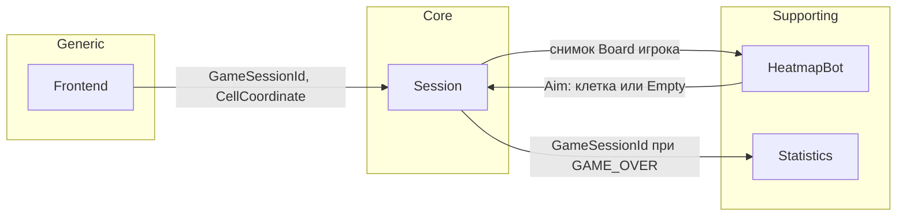

# Доменная модель (DDD)

**Статус:** `Черновик, требует согласования`  
**Дата:** 2026-08-25  
**Назначение:** структура бизнес-сущностей Sea Battle без привязки к СУБД, API-схемам и стеку. Имена — английские идентификаторы для вайбкодинга.  
**Источники:** `glossary.md`, `functional-requirements.md`, `answers-project.md`, US-001…US-008, UC-001…UC-008; A0138…A0143; рефакторинг по аудиту — A0144 (`reports/domain-model-review.md`).  
**Приоритет фактов:** закрытые ответы `Axxxx` и согласованные ФТ важнее предварительного ТЗ при расхождении.

Термины и коды в **описаниях** (`MISS`, `HIT`, `SUNK`, `GAME_OVER`, Hunt Mode, Target Mode, игровая сессия, Бэкенд, Фронтенд) — по глоссарию. «Игровая сессия» и «матч» — один объект (A0010) = сущность `Session`.

В модели **нет** сущности «Игрок как учётная запись» (A0016). Доступ к партии — секрет `GameSessionId` (A0048, NFT-017).

### Соглашение об именах

| Что | Правило |
| --- | --- |
| Bounded Context, Aggregate, Entity, Value Object | PascalCase, одно или два английских слова |
| Атрибут | camelCase, одно или два английских слова |
| Описания, инварианты, ссылки на ФТ | русский текст |
| Протокольные коды | без изменений: `MISS`, `HIT`, `SUNK`, `GAME_OVER`, `SESSION_ABORTED`, `SHOT_WRONG_CHANNEL` |
| Значения enum | английские литералы; смысл — в колонке «Описание» |

Связи **между агрегатами** — только идентификаторы. Прямых объектных ссылок между корнями нет.

---

## Карта ограниченных контекстов и смысловых ядер

| Bounded Context | Ядро (subdomain) | Тип | Зачем выделен |
| --- | --- | --- | --- |
| Session | Правила PvE и жизненный цикл игровой сессии | **Core** | Поля, флот, выстрел, ход, конец партии, TTL, лимит слотов |
| Heatmap | Heatmap Bot (Hunt / Target) | **Supporting** | Выбор клетки Бэкенда; не входит в FT-002; **агрегата нет** |
| Statistics | Учёт завершённых партий | **Supporting** | Общая статистика на сервер (A0015) |
| Frontend | Язык UI, экранные координаты, память запуска | **Generic** | Бэкенд язык сессии не хранит (A0091, FT-073) |

**Доменные службы (не агрегаты):** `StartSession` (слот Registry + создание Session); генерация расстановки (FT-010…FT-013); `HeatmapBot.aim`; применение выстрела и хода — методы корня `Session`.

**Вне MVP:** PvP, ручная расстановка, логин, рейтинг, персональная статистика.

---

## Session

Контекст проводит партию PvE: жизненный цикл игровой сессии, поля, флоты, выстрелы, ход, TTL, лимит слотов. Core.

`Registry` — отдельный корень в том же BC (инвариант «≤ 3» нельзя положить внутрь одной Session). Отдельный BC не вводится (A0143).

---

### Агрегат: Session

*Один матч. Единственная точка входа для изменения полей, флота, истории выстрелов и права хода. Снаружи — только `GameSessionId`.*

Матрица вероятностей внутрь агрегата **не входит**.

#### 1. Сущности (Entities)

| Сущность | Атрибут | Тип данных (Бизнес) | Обязательность | Правила / Валидация | Описание |
| :--- | :--- | :--- | :--- | :--- | :--- |
| Session | id | GameSessionId (ID) | Да | Уникальный; пространство ≥ 2^128; секрет; неизвестный/чужой id → единый отказ «сессия недоступна» (FT-067, A0001) | Выдаётся только после успешного старта (выдача расстановки Игроку) |
| Session | mode | GameMode (Enum) | Да | Только `PvE` | FT-043 |
| Session | status | SessionStatus (Enum) | Да | `Active` или `GameOver` | `GameOver` — момент фиксации конца; длительное хранение агрегата после этого не требуется (A0142) |
| Session | turn | Side (Enum) | Да | `Player` или `Backend`; при старте `Player` | Право хода (не путать с `Shot.seq`) |
| Session | winner | Side (Enum) | Нет | Только при `GameOver`; при сдаче всегда `Backend` | FT-026, FT-077 |
| Session | endReason | EndReason (Enum) | Нет | Только `FleetLost` или `Surrender` вместе с `GameOver` | TTL и `SESSION_ABORTED` сюда не входят |
| Session | ttlAnchor | Метка времени | Да | Меняется только при создании и при **принятом** выстреле | FT-005 |
| Session | idleTtl | IdleTtl (VO) | Да | Ровно 30 минут | Возобновление, язык, статистика не сдвигают |
| Session | connected | Логический | Да | Не более одного активного соединения | Reconnect того же запуска замещает соединение (A0133); второй экземпляр — отказ (FT-068) |
| Session | playerBoard | Board (Entity) | Да | Ровно одно | Поле Игрока |
| Session | backendBoard | Board (Entity) | Да | Ровно одно | Поле Бэкенда; скрыто до `HIT`/`SUNK` палуб (FT-015) |
| Session | playerFleet | Fleet (Entity) | Да | Ровно один | Выдаётся Игроку (FT-014) |
| Session | backendFleet | Fleet (Entity) | Да | Ровно один | Игроку целиком не выдаётся |
| Session | shots | набор Shot (Entity) | Да | 0..N; `seq` строго возрастает | История выстрелов (FT-002) |
| Board | owner | Side (Enum) | Да | Совпадает с владельцем флота | Чьё поле |
| Board | size | BoardSize (VO) | Да | 10×10 | FT-006 |
| Board | cells | набор Cell (VO) | Да | Ровно 100; ключ — уникальные `coords` [0..9, 0..9] | Матрица поля; Cell — VO, не сущность |
| Fleet | owner | Side (Enum) | Да | `Player` или `Backend` | Владелец |
| Fleet | ships | набор Ship | Да | 10 кораблей, 20 палуб, состав 1+2+3+4 | FT-009 |
| Ship | id | ShipId (ID) | Да | Уникален внутри Session | A0140; Target Mode (FT-079) |
| Ship | type | ShipType (Enum) | Да | `Battleship` / `Cruiser` / `Destroyer` / `Boat` | Линкор / крейсер / эсминец / катер |
| Ship | length | Целое | Да | 4 / 3 / 2 / 1 по типу | Число палуб |
| Ship | facing | Facing (Enum) | Да | `Horizontal` или `Vertical` | FT-011 |
| Ship | decks | набор Deck (VO) | Да | Ровно `length`; непрерывный отрезок | Палубы |
| Ship | status | ShipStatus (Enum) | Да | `Intact` / `Wounded` / `Sunk` | Для Hunt/Target; в API выстрела не подменять код `HIT` |
| Shot | seq | Целое | Да | ≥ 1; уникален и строго возрастает в сессии | Канон идемпотентности до API (A0141). «Ход» для статистики = этот выстрел |
| Shot | shooter | Side (Enum) | Да | Сторона принятого выстрела | Стреляющий |
| Shot | coords | CellCoordinate (VO) | Да | Клетка поля соперника; [0..9, 0..9] | Цель |
| Shot | result | ShotResult (Enum) | Да | `MISS` / `HIT` / `SUNK` | A0028 |

Производные: число выстрелов = количество `Shot`; остаток idle TTL = `idleTtl` минус время с `ttlAnchor` (FT-080); флот уничтожен ⇔ все 10 кораблей `Sunk`; код клетки = `CellCoordinate.code`. Идемпотентный ключ транспорта = `seq` (отдельный `eventId` в модели не хранится, A0141).

#### 2. Объекты-Значения (Value Objects)

| Объект-Значение | Атрибут | Тип данных (Бизнес) | Правила / Валидация | Описание |
| :--- | :--- | :--- | :--- | :--- |
| GameSessionId | value | ID | Мощность пространства ≥ 2^128; непрозрачный секрет | Идентификатор и ключ доступа к партии |
| CellCoordinate | column | Целое | 0…9 | Индекс столбца (А/A = 0 … К/J = 9) |
| CellCoordinate | row | Целое | 0…9 | Индекс строки (экранное 1 = 0 … 10 = 9) |
| CellCoordinate | code | Строка | Производное: ровно две цифры; А3/A3 → `02`; не меняется от языка UI | FT-063; не хранить отдельно от column/row |
| Cell | coords | CellCoordinate | Уникален в пределах Board | Клетка игрового поля |
| Cell | occupancy | Occupancy | Пусто или палуба корабля **этого** флота | Занятость |
| Cell | mark | Mark (Enum) | `Unchecked` / `MISS` / `HIT` / `SUNK`; буферная зона = `MISS` | FT-021, FT-044 |
| BoardSize | n | Целое | Ровно 10 | Поле 10×10 |
| Side | code | Enum | `Player` / `Backend` | Участник без учётной записи |
| Occupancy | kind | Enum | `Empty` или `Deck` | Содержимое до отметки выстрела |
| Occupancy | ship | ShipId (ID) | Обязателен, если kind = `Deck` | Связь Cell → Ship внутри агрегата |
| Deck | coords | CellCoordinate | На поле владельца; клетки одного корабля — непрерывный ортогональный отрезок | Палуба |
| Deck | destroyed | Логический | true после `HIT`/`SUNK` по этой палубе | Повреждение палубы |
| ShipType | code | Enum | Battleship↔4, Cruiser↔3, Destroyer↔2, Boat↔1 | Класс |
| ShipStatus | code | Enum | Intact / Wounded / Sunk | Состояние корабля, не код выстрела |
| Composition | battleships | Целое | Ровно 1 | Норма состава флота |
| Composition | cruisers | Целое | Ровно 2 | Норма состава |
| Composition | destroyers | Целое | Ровно 3 | Норма состава |
| Composition | boats | Целое | Ровно 4 | Норма состава |
| Facing | code | Enum | Только `Horizontal` или `Vertical` | Правило расстановки |
| Mark | code | Enum | `Unchecked` / `MISS` / `HIT` / `SUNK` | Непроверенная клетка — `Unchecked` |
| ShotResult | code | Enum | `MISS` / `HIT` / `SUNK` | «Попадание» и «ранен» не разделяются (A0028) |
| SessionStatus | code | Enum | `Active` / `GameOver` | Жизненный цикл хранимого агрегата |
| EndReason | code | Enum | `FleetLost` / `Surrender` | Не TTL и не пустая heatmap |
| IdleTtl | minutes | Целое | Ровно 30 | Скользящее окно бездействия |
| GameMode | code | Enum | Только `PvE` | Режим партии |

#### 3. Бизнес-инварианты и правила

* Сессия не существует и слот не занимает, пока старт не завершён выдачей расстановки Игроку; отказ в окне NFT-015 — без сессии и без статистики (FT-010, A0081).
* Выдать Игроку только `playerFleet` / `playerBoard` (FT-014); флот Бэкенда и heatmap не отдавать (FT-015, FT-050).
* Только PvE; ручной расстановки нет.
* Оба флота: 10 кораблей / 20 палуб, состав 1 линкор + 2 крейсера + 3 эсминца + 4 катера; корабли прямолинейны; между любыми клетками разных кораблей одного флота минимум одна пустая клетка, включая углы (FT-011, FT-012, FT-013).
* Координаты каждой палубы `Ship.decks` совпадают с клетками своего `Board`, у которых `occupancy.ship` равен этому `ShipId`, и наоборот.
* Первый ход — у Игрока (FT-016). Выстрел до старта запрещён (FT-069).
* Выстрел игрока — только канал партии реального времени; иначе отказ `SHOT_WRONG_CHANNEL` без изменения состояния (FT-055). Сдача — тот же канал партии (A0130).
* Запрос выстрела без координат или с неверным типом — отказ без изменения состояния (FT-070).
* Стрелять можно только по полю соперника, в клетку `Unchecked` с индексами [0..9, 0..9], при своём `turn`, пока статус `Active` (FT-044…FT-048).
* `MISS` — ход переходит сопернику; `HIT` и `SUNK` — ход остаётся у стреляющего.
* При `SUNK` последняя палуба имеет отметку `SUNK`; периметр корабля помечается `MISS` и отдаётся Фронтенду (FT-021, FT-072).
* Уничтожение всех 10 кораблей (20 палуб) одной стороны → в том же исходе `SUNK` и отдельно `GAME_OVER`, победа противоположной стороны (FT-025, FT-026, FT-071). Отдельного атрибута `gameOver` на `Shot` нет.
* Сдача: `GAME_OVER` с победой Бэкенда, в том числе на ходе Бэкенда; обрыв соединения сдачей не является; после `GAME_OVER` повторная сдача не фиксируется (FT-077).
* Конкурирующие мутации одной сессии упорядочены: применяется первая принятая (A0124). Сдача до фиксации выстрела Бэкенда отменяет этот выстрел (A0126).
* Одновременные лишние выстрелы той же стороны после первого принятого — отклоняются (FT-051).
* Применение выстрела атомарно относительно состояния этой сессии. Выстрел в сессии A не меняет поля, историю выстрелов и ход сессии B (FT-003).
* Idle TTL сдвигают только создание сессии и принятый выстрел. Истечение TTL удаляет состояние без `GAME_OVER` и без статистики; Фронтенд оповещается (FT-053, FT-066).
* Обрыв соединения слот лимита не освобождает, пока сессия `Active` и TTL жив (FT-074).
* При `GAME_OVER` слот лимита освобождается сразу (A0128). Длительно хранить агрегат `Session` для просмотра снимка не требуется (A0142); исход для статистики — `Ledger`.
* Возобновление по id, пока TTL не истёк: семантически эквивалентный снимок по FT-002; TTL возобновлением не сдвигается (FT-054). Недоступный id — единый отказ без различия причин (FT-067).
* Доменные события партии (не агрегаты): смена права хода; результат выстрела `MISS` / `HIT` / `SUNK` любой стороны; `GAME_OVER`; выстрел Бэкенда (FT-036); истечение TTL (FT-066); `SESSION_ABORTED` (FT-076). Создание сессии — ответ на запрос старта, без отдельного push.

#### 4. Связи

| От | К | Кратность | Как связывается |
| --- | --- | --- | --- |
| Session | Board | 1 : 2 | Внутри агрегата (`playerBoard`, `backendBoard`) |
| Session | Fleet | 1 : 2 | Внутри агрегата |
| Session | Shot | 1 : 0..N | История внутри агрегата |
| Board | Cell | 1 : 100 | VO внутри Board |
| Fleet | Ship | 1 : 10 | Внутри агрегата |
| Ship | Deck | 1 : 1…4 | VO внутри корабля |
| Cell | Ship | 0..1 : 1 | `occupancy.ship` (ShipId внутри агрегата) |
| Session | Registry | N : 1 | Только `GameSessionId` |
| Session | Record | 0..1 : 1 | Только `GameSessionId` после `GAME_OVER` |
| Runtime | Session | 0..1 : 1 | Только `GameSessionId` |

---

### Агрегат: Registry

*Ограничение «не более трёх активных игровых сессий». Не содержит полей и выстрелов. Отдельный BC не вводится (A0143).*

В MVP один экземпляр Бэкенда (FT-004 / MR-01).

#### 1. Сущности (Entities)

| Сущность | Атрибут | Тип данных (Бизнес) | Обязательность | Правила / Валидация | Описание |
| :--- | :--- | :--- | :--- | :--- | :--- |
| Registry | id | BackendId (ID) | Да | В MVP единственный экземпляр | Корень лимита слотов |
| Registry | slots | набор GameSessionId | Да | Мощность 0…3; без дубликатов | Сессии, учтённые в FT-004 |

#### 2. Объекты-Значения (Value Objects)

| Объект-Значение | Атрибут | Тип данных (Бизнес) | Правила / Валидация | Описание |
| :--- | :--- | :--- | :--- | :--- |
| Slot | sessionId | GameSessionId (ID) | Только после успешного старта, пока слот не снят | Занятое место в лимите |
| SlotLimit | max | Целое | Ровно 3 | Потолок FT-004 |

#### 3. Бизнес-инварианты и правила

* Сессия попадает в реестр только после успешного старта (выдача расстановки Игроку), не раньше.
* Четвёртая активная сессия невозможна (FT-049); отказ без записи в статистику.
* Слот снимается сразу при `GAME_OVER`, при удалении по idle TTL и при `SESSION_ABORTED` (FT-075). Обрыв соединения слот не снимает.
* Старт координирует служба `StartSession` (проверка Registry → создание Session → запись id в слот), без вложенности агрегатов.

#### 4. Связи

| От | К | Кратность | Как связывается |
| --- | --- | --- | --- |
| Registry | Session | 0..3 : 1 | Только набор `GameSessionId` |

---

## Heatmap

Контекст выбирает клетку выстрела Бэкенда по матрице вероятностей. Supporting: без партии не существует; результат не хранится в FT-002 и Игроку не показывается (FT-050, A0095).

**Агрегата нет.** Расчёт — доменная служба.

---

### Служба: HeatmapBot

Вход: снимок поля Игрока (отметки, ранения, оставшиеся корабли). Выход: VO `Aim`. Применение выстрела выполняет корень `Session`.

#### 1. Сущности (Entities)

Нет.

#### 2. Объекты-Значения (Value Objects)

| Объект-Значение | Атрибут | Тип данных (Бизнес) | Правила / Валидация | Описание |
| :--- | :--- | :--- | :--- | :--- |
| Heatmap | cells | 10×10 CellWeight | Индексы [0..9, 0..9] | Матрица вероятностей (термин глоссария) |
| CellWeight | coords | CellCoordinate | Как в Session | Адрес |
| CellWeight | weight | Десятичное / Целое ≥ 0 | Вне области Target Mode вес = 0 | В Hunt — число способов поставить оставшиеся корабли |
| Remaining | lengths | набор Целых | Длины всех ещё не потопленных кораблей Игрока с учётом количества (A0040) | Вход Hunt Mode |
| TargetArea | kind | Enum | Один `HIT` — ортогональный крест (`Cross`); два и более на линии — продолжения оси до края или `MISS` (`Axis`) (FT-058) | Область добивания |
| HeatmapMode | code | Enum | `Hunt` / `Target` | Режим поиска vs добивания |
| Aim | outcome | Enum | `Picked` / `Empty` | `Empty` = нет свободных клеток с весом > 0 |
| Aim | pick | CellCoordinate | Обязателен при `Picked`; непроверенная клетка поля Игрока | Цель выстрела Бэкенда (FT-064, FT-034) |
| Aim | targetShip | ShipId (ID) | Обязателен в Target; при нескольких раненых — один корабль до `SUNK` (FT-079) | Ссылка ID на Ship внутри Session |

#### 3. Бизнес-инварианты и правила

* Расчёт только если `turn = Backend` и Session в статусе `Active`.
* Выбирается клетка с максимальным весом; при равенстве — случайно из лидеров (FT-034, FT-064).
* Матрица и режимы Hunt/Target Игроку не передаются.
* `Aim.outcome = Empty`: выстрел не выполнять (FT-065). Сначала проверка уничтожения флота Игрока (FT-052): если флот уничтожен — `Session` фиксирует `GAME_OVER` с `endReason = FleetLost` и статистикой; иначе сбой: событие `SESSION_ABORTED`, затем удаление сессии и слота без статистики (FT-076, затем FT-075).
* Служба не пишет `Ledger` и не входит в оперативное состояние FT-002.

#### 4. Связи

| От | К | Кратность | Как связывается |
| --- | --- | --- | --- |
| Aim | Session | на один ход : 1 | Расчёт по снимку; в состоянии службы `sessionId` не хранится |
| Aim | Ship | 0..1 : 1 | Только `targetShip` (ShipId внутри Session) |

---

## Statistics

Контекст хранит записи завершённых партий и отдаёт агрегаты по запросу. Supporting. В MVP счётчики общие на сервер (A0015).

---

### Агрегат: Ledger

*Единственный журнал завершённых игр. Одна запись на один `GAME_OVER`, без двойного начисления.*

#### 1. Сущности (Entities)

| Сущность | Атрибут | Тип данных (Бизнес) | Обязательность | Правила / Валидация | Описание |
| :--- | :--- | :--- | :--- | :--- | :--- |
| Ledger | id | BackendId (ID) | Да | В MVP один журнал на сервер | Корень |
| Ledger | records | набор Record | Да | 0..N | Источник среднего и счётчиков |
| Record | id | RecordId (ID) | Да | Уникален в журнале | Одна завершённая партия |
| Record | sessionId | GameSessionId (ID) | Да | Уникален среди записей | Сессия к моменту чтения статистики может уже не храниться |
| Record | winner | Side (Enum) | Да | `Player` или `Backend` | Для счётчиков побед |
| Record | shots | Целое | Да | ≥ 0; сдача при нуле выстрелов допустима | Для среднего; ход = один выстрел |
| Record | endReason | EndReason (Enum) | Да | Только `FleetLost` или `Surrender` | Не TTL, не abort |

Точный JSON и округление среднего — отложены (A0134); среднее — производная величина.

#### 2. Объекты-Значения (Value Objects)

| Объект-Значение | Атрибут | Тип данных (Бизнес) | Правила / Валидация | Описание |
| :--- | :--- | :--- | :--- | :--- |
| Snapshot | games | Целое | ≥ 0; равно числу записей | FT-038 |
| Snapshot | playerWins | Целое | ≥ 0; не больше числа игр | FT-039 |
| Snapshot | backendWins | Целое | ≥ 0; не больше числа игр | FT-040 |
| Snapshot | avgShots | Десятичное | При нуле записей = 0; иначе сумма `shots` / число записей | A0088 |

#### 3. Бизнес-инварианты и правила

* Статистика меняется **только** при `GAME_OVER` (FT-056). TTL, обрыв, `SESSION_ABORTED` записей не создают.
* На каждый исход — ровно одна запись. Совместная фиксация с `GAME_OVER` в Session — A0129; при сбое записи — повтор без второго `GAME_OVER`. Это единственная допустимая согласованность двух корней.
* `playerWins + backendWins = games`.
* Запрос снимка не меняет партии и не сдвигает idle TTL (UC-007).
* Фронтенд не может произвольно писать счётчики.

#### 4. Связи

| От | К | Кратность | Как связывается |
| --- | --- | --- | --- |
| Ledger | Record | 1 : 0..N | Внутри агрегата |
| Record | Session | 1 : 0..1 | Только `sessionId` |

---

## Frontend

Контекст Фронтенда: язык интерфейса, экранные буквы координат, id сессии в памяти запуска. Generic: смена языка не пересоздаёт сессию и не меняет коды клеток (FT-073).

---

### Агрегат: Settings

*Локальные настройки машины игрока. Не содержат состояния партии.*

#### 1. Сущности (Entities)

| Сущность | Атрибут | Тип данных (Бизнес) | Обязательность | Правила / Валидация | Описание |
| :--- | :--- | :--- | :--- | :--- | :--- |
| Settings | id | InstallId (ID) | Да | Локально на машине; не равен `GameSessionId` | Корень |
| Settings | language | Language (Enum) | Да | Только `RU` или `EN` | FT-060, FT-062 |

#### 2. Объекты-Значения (Value Objects)

| Объект-Значение | Атрибут | Тип данных (Бизнес) | Правила / Валидация | Описание |
| :--- | :--- | :--- | :--- | :--- |
| Language | code | Enum | `RU` / `EN` | Другие значения не сохранять |
| DisplayCoord | letter | Строка | RU: А–К без «Ё» и «Й»; EN: A–J | Только отображение (FT-008) |
| DisplayCoord | number | Целое | 1…10 | Только отображение |
| Glyph | mark | Mark | Канон A0099 | `SUNK` → «X»; `HIT` → «звёздочка»; `MISS` (включая буфер) → «тире»; `Unchecked` → пустая |

#### 3. Бизнес-инварианты и правила

* Бэкенд язык не хранит (A0091).
* Смена языка сразу меняет подписи и экранные координаты; коды клеток в Session не меняются; TTL не сдвигается (FT-073).
* `DisplayCoord` — функция `(CellCoordinate, Language)`, в Session не хранится.
* При смене версии Фронтенда: если ключ языка есть — использовать его, иначе правило первого запуска (A0136).
* Недопустимое значение языка игнорируется или откатывается к последнему валидному / EN.

#### 4. Связи

Нет ссылок на агрегаты Бэкенда.

---

### Агрегат: Runtime

*Эфемерное состояние процесса текущего запуска. После полного перезапуска приложения очищается (A0132, A0093).*

#### 1. Сущности (Entities)

| Сущность | Атрибут | Тип данных (Бизнес) | Обязательность | Правила / Валидация | Описание |
| :--- | :--- | :--- | :--- | :--- | :--- |
| Runtime | id | LaunchId (ID) | Да | Живёт, пока жив процесс Фронтенда | Корень |
| Runtime | settingsId | InstallId (ID) | Да | Только идентификатор агрегата Settings | Связь между корнями по ID |
| Runtime | sessionId | GameSessionId (ID) | Нет | 0..1; не персистится на диск в MVP | Автовозобновление соединения того же запуска |
| Runtime | shotPending | Логический | Да | Пока true — повторный клик по клетке блокируется (A0116) | Не заменяет серверный FT-051 |
| Runtime | surrenderPending | Логический | Да | После «Вы уверены?» до ответа сервера (A0131) | Не заменяет FT-077 |

#### 2. Объекты-Значения (Value Objects)

| Объект-Значение | Атрибут | Тип данных (Бизнес) | Правила / Валидация | Описание |
| :--- | :--- | :--- | :--- | :--- |
| RemainTtl | value | Длительность | ≥ 0; любой читаемый формат показа (A0120) | Копия для UI; источник истины — Session (FT-080) |
| ErrorCode | code | Строка / Enum | В т.ч. `SHOT_WRONG_CHANNEL`; единый отказ возобновления «сессия недоступна» | Контракт отказов для игрока |

#### 3. Бизнес-инварианты и правила

* Экрана ввода id сессии в MVP нет; после рестарта приложения партия прошлого запуска не подхватывается (A0093). Контракт Бэкенда FT-054 сохраняется.
* Автовозобновление замещает полуоткрытое соединение того же запуска и не считается вторым Фронтендом (A0133).
* Закрытие окна / kill процесса ≠ сдача.

#### 4. Связи

| От | К | Кратность | Как связывается |
| --- | --- | --- | --- |
| Runtime | Session | 0..1 : 1 | `sessionId` |
| Runtime | Settings | 1 : 1 | `settingsId` |

---

## Сводка связей между агрегатами

Только идентификаторы:

| Агрегат A | Агрегат B | Кратность | ID |
| --- | --- | --- | --- |
| Registry | Session | 0..3 : 1 | `GameSessionId` |
| Record | Session | 0..1 : 1 | `GameSessionId` |
| Runtime | Session | 0..1 : 1 | `GameSessionId` |
| Runtime | Settings | 1 : 1 | `InstallId` |
| Aim (результат HeatmapBot) | Ship | 0..1 : 1 | `ShipId` (внутри Session, не корень) |

Агрегата Heatmap нет. Совместная фиксация двух корней допустима только для `Session` + `Ledger` при `GAME_OVER` (A0129).

---

## Допущения модели (не факты требований)

1. **Registry** как отдельный корень внутри BC Session — способ записать инвариант «≤ 3» (BC не разделять: A0143).
2. **RecordId, InstallId, LaunchId, BackendId** — технические корни DDD, не коды API.
3. Тип `GameSessionId` не зафиксирован как UUID: зафиксирована мощность пространства ≥ 2^128 (NFT-017).
4. Имя VO матрицы — `Heatmap` (глоссарий); служба — `HeatmapBot`, чтобы не путать с BC Heatmap.

---

## Открытые вопросы к заказчику

Нет.

Перенос имён модели в колонку EN глоссария — только по явной команде.
